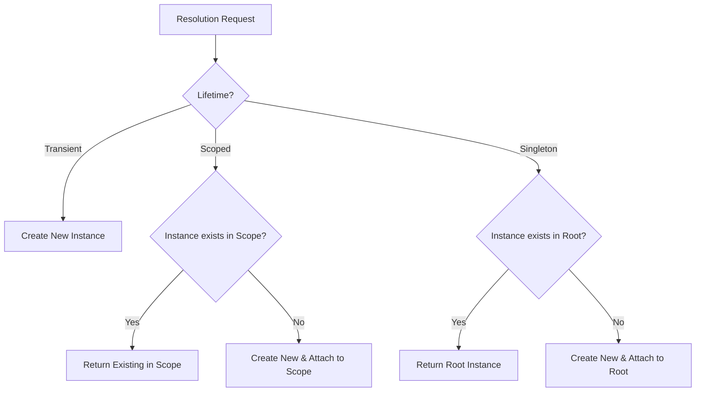
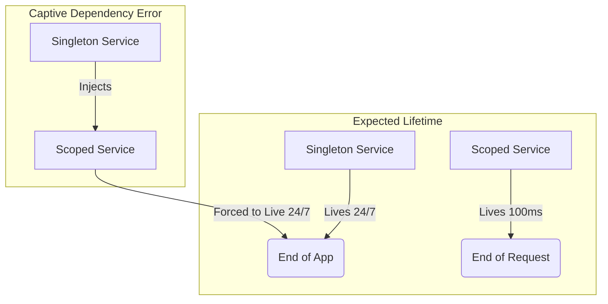
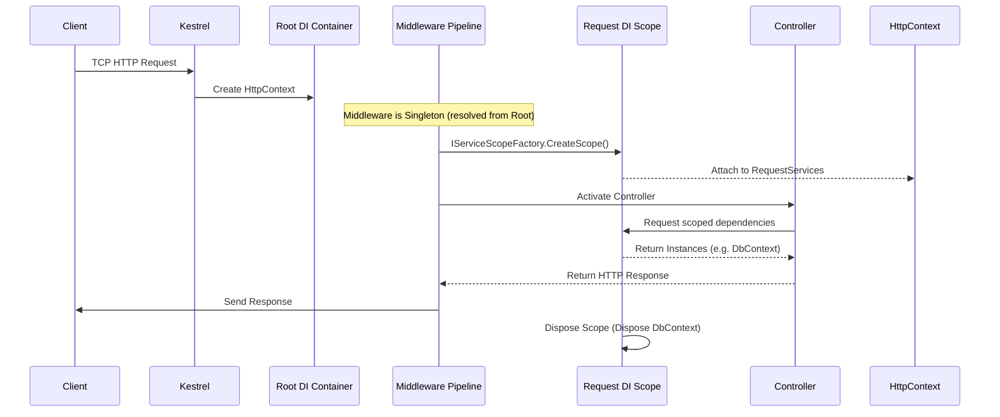

# Dependency Injection in .NET — Complete Deep Dive: Junior to Solution Architect

## Part 1 — What is Dependency Injection and Why It Exists

### 1. Plain English Explanation
**WHAT:** Dependency Injection (DI) is a software design pattern where an object receives its dependencies from an external source rather than creating them itself. 
**WHY:** It exists to solve the problem of tight coupling. When a class uses the `new` keyword to instantiate its dependencies, it becomes permanently bound to that specific implementation. This makes the code rigid, difficult to change, and nearly impossible to unit test in isolation. DI enforces Inversion of Control (IoC), adhering to the "Hollywood Principle: Don't call us, we'll call you."

### 2. Real-World Analogy
Imagine a **restaurant kitchen**. 
In a tightly coupled kitchen, the Head Chef has to personally go to the farm, buy the tomatoes, chop the wood for the oven, and then cook the meal. This is exhausting and doesn't scale.
In a DI-powered kitchen, the Chef simply declares: "I need chopped tomatoes and a hot oven." The Kitchen Manager (the DI Container) sources the ingredients and hands them to the Chef (Constructor Injection). If the manager switches the tomato supplier tomorrow, the Chef doesn't care, as long as they receive tomatoes.

### 3. C# .NET 8 Code Example
```csharp
// Context: Financial Audit API
public interface IAuditRepository { void Save(string message); }
public class SqlAuditRepository : IAuditRepository { public void Save(string message) { /* SQL Insert */ } }
public class FileAuditRepository : IAuditRepository { public void Save(string message) { /* File Write */ } }

// ❌ Bad Practice: Tight Coupling (The "new" keyword problem)
public class AuditService_Bad
{
    private readonly SqlAuditRepository _repository;
    
    public AuditService_Bad()
    {
        // This service is now permanently glued to SQL Server. Cannot be mocked!
        _repository = new SqlAuditRepository();
    }
}

// ✅ Good Practice: Manual Dependency Injection
public class AuditService_Better
{
    private readonly IAuditRepository _repository;
    
    // Dependencies are explicitly requested via the constructor
    public AuditService_Better(IAuditRepository repository)
    {
        _repository = repository;
    }
}

// ✅ Good Practice: Container-Managed DI (The setup)
// Program.cs
// builder.Services.AddScoped<IAuditRepository, SqlAuditRepository>();
// builder.Services.AddScoped<AuditService_Better>();
```

### 4. Under the Hood
At runtime, without a DI container, the CLR allocates memory for `AuditService_Bad` and subsequently allocates memory for `SqlAuditRepository` on the heap during the constructor execution. The caller has no control over the `SqlAuditRepository` lifecycle. 
With DI, the caller (or the DI Container) creates the `SqlAuditRepository` first, passes its reference to the constructor of `AuditService_Better`. The CLR simply assigns the pointer to the `_repository` field.

### 5. Production Relevance
In enterprise applications, changing infrastructure (e.g., swapping a local SQL database for Azure Cosmos DB) should not require rewriting business logic. DI creates a hard boundary between the *what* (business rules) and the *how* (infrastructure). It also is the foundational enabler for automated unit testing; without it, you are writing integration tests, not unit tests.

### 6. Common Mistakes and Misconceptions
- **Mistake:** Using the Service Locator pattern (e.g., passing the entire container into the service) instead of injecting specific dependencies. This hides the actual requirements of the class.
- **Misconception:** Thinking DI and a DI Container are the same thing. DI is the *pattern* (passing dependencies). The DI Container is the *tool* (the framework that automates the passing).

### Mock Interview Block

**Interviewer:** Can you explain what Dependency Injection is and why we use it in .NET?

**Candidate:** Dependency Injection is a design pattern where an object receives its dependencies from the outside rather than creating them internally using the `new` keyword. We use it to decouple our classes, making the code more modular, maintainable, and highly testable since we can easily swap real implementations with mocks during unit testing.

**Interviewer:** That makes sense. What's the difference between Dependency Injection and a DI Container?

**Candidate:** DI is just the concept of passing dependencies, usually through a constructor. A DI Container is a framework or tool—like Microsoft.Extensions.DependencyInjection—that acts as a central registry. Instead of manually newing up the dependency graph and passing it down, the container automatically figures out the graph and injects the right instances when a class is requested.

**Interviewer:** Let's say you take over an old codebase that doesn't use DI, and classes instantiate their own dependencies everywhere. Why is that specifically a problem for a production system?

**Candidate:** It creates tight coupling, meaning a change in a low-level data access class cascades up and requires recompiling the business layer. It also prevents unit testing, because you can't isolate the business logic from the database or file system. Finally, it makes lifecycle management a nightmare—if a database connection should be shared across the request, but every class news up its own, you'll quickly exhaust connection pools.

**Interviewer:** Speaking of lifecycle management, what if a developer decides to just pass the `IServiceProvider` into every constructor so the class can just resolve what it needs? 

**Candidate:** That is the Service Locator anti-pattern. While it "works," it's highly discouraged because it hides the class's actual dependencies. A constructor should act as a contract detailing exactly what it needs to function. If you inject `IServiceProvider`, I have to read the entire implementation to know what services are being resolved, and it makes mocking much harder.

**Interviewer:** We have a legacy third-party class that requires a parameter in its constructor that can only be known at runtime, not at startup. How do you handle this without breaking the DI paradigm?

**Candidate:** I wouldn't try to force the runtime parameter into the startup DI registrations. Instead, I would use the Factory Pattern. I'd register a factory interface in the DI container. The consumer injects the factory, and then calls a method like `factory.Create(runtimeParameter)`. The factory itself can resolve any static dependencies from the container while accepting the dynamic parameters at runtime.

---

## Part 2 — The .NET Built-in DI Container

### 1. Plain English Explanation
**WHAT:** The built-in .NET DI Container (`Microsoft.Extensions.DependencyInjection`) is the default IoC container provided by Microsoft. It uses `IServiceCollection` to store recipes (how to build things) and `IServiceProvider` to cook the meals (resolve the instances).
**WHY:** Microsoft built a native, lightweight container to ensure all .NET applications (ASP.NET Core, Worker Services, MAUI) have a standardized, unified way to manage dependencies without forcing developers to rely on third-party libraries out of the box.

### 2. Real-World Analogy
Think of `IServiceCollection` as the **menu and recipe book** at a restaurant. It knows that a "Burger" requires a "Bun" and a "Patty".
Think of `IServiceProvider` as the **kitchen line**. When a customer orders a "Burger", the kitchen line looks at the recipe book, gathers the ingredients, assembles them, and hands back the finished Burger. You cannot change the menu (`IServiceCollection`) once the kitchen opens (`IServiceProvider` is built).

### 3. C# .NET 8 Code Example
```csharp
// Context: Multi-tenant SaaS Platform
using Microsoft.Extensions.DependencyInjection;

// 1. The Menu (IServiceCollection)
IServiceCollection services = new ServiceCollection();

// ✅ Good Practice: Registration variants
services.AddTransient<ITenantResolver, HeaderTenantResolver>(); // Type mapping
services.AddSingleton<GlobalCache>(); // Self-registered
services.AddScoped(provider => 
{
    // Factory delegate registration
    var cache = provider.GetRequiredService<GlobalCache>();
    return new BillingService(cache, tenantId: "runtime-determined");
});

// ❌ Bad Practice: Building the provider manually in an ASP.NET Core app
// var provider = services.BuildServiceProvider(); // ASP.NET Core does this for you!

// 2. The Kitchen (IServiceProvider)
// In WebApplication.CreateBuilder(), calling builder.Build() triggers this internally.
IServiceProvider provider = services.BuildServiceProvider();

// ✅ Good Practice: Resolving
var tenantResolver = provider.GetRequiredService<ITenantResolver>();

// ❌ Bad Practice: GetService can return null, leading to NREs if not checked
var missingService = provider.GetService<IUnknownService>(); 
```

### 4. Under the Hood
When you call `AddScoped`, `AddSingleton`, or `AddTransient`, you are simply adding a `ServiceDescriptor` to a `List<ServiceDescriptor>` (which is what `IServiceCollection` is). A `ServiceDescriptor` holds the Service Type, Implementation Type, Lifetime, and optionally a Factory Delegate or a direct Instance.
When `BuildServiceProvider()` is called, the CLR compiles these descriptors into a highly optimized expression tree or a dynamic method call graph using `CallSiteFactory`. This makes resolution extremely fast.

### 5. Production Relevance
In ASP.NET Core, `WebApplicationBuilder` gives you access to `builder.Services`. Once `builder.Build()` is called, the container becomes immutable. This immutability guarantees thread safety during resolution. You should **never** call `builder.Services.BuildServiceProvider()` inside your `Program.cs` setup to resolve a dependency early. This creates a secondary container, leading to multiple singleton instances (the infamous "Two Containers" bug).

### 6. Common Mistakes and Misconceptions
- **Mistake:** Calling `BuildServiceProvider()` inside `ConfigureServices` to resolve a database context for EF Core migrations. This creates duplicate singletons.
- **Misconception:** `GetService<T>()` vs `GetRequiredService<T>()`. Developers often use `GetService` and forget to null-check. Always use `GetRequiredService` unless the dependency is truly optional.

### Mock Interview Block

**Interviewer:** In .NET, what is the difference between `IServiceCollection` and `IServiceProvider`?

**Candidate:** `IServiceCollection` is the registry where we configure all our services, their implementations, and their lifetimes. It's essentially a list of `ServiceDescriptor` objects. `IServiceProvider` is the actual engine built from that collection. Once the provider is built, the collection is sealed, and we use the provider to resolve and inject instances at runtime.

**Interviewer:** You mentioned `GetRequiredService`. How does that differ from `GetService`, and when would you use each?

**Candidate:** `GetService` returns null if the service isn't registered, which means you have to handle the null case manually. `GetRequiredService` throws an `InvalidOperationException` if the service is missing. I default to `GetRequiredService` because missing dependencies are usually fatal configuration errors and I want the app to fail fast. I only use `GetService` when a dependency is genuinely optional by design.

**Interviewer:** I see developers sometimes call `builder.Services.BuildServiceProvider()` in their `Program.cs` because they need to resolve a service to configure another service. Why is this a problem?

**Candidate:** That is a dangerous anti-pattern. Calling `BuildServiceProvider` manually creates a second, completely separate instance of the DI container. If you have singletons registered before that call, they will be instantiated in the temporary container, and then instantiated *again* when the framework builds the final container. You end up with multiple singletons, which causes hard-to-track bugs.

**Interviewer:** If you can't build the provider manually, how *do* you use an injected service to configure another one during startup?

**Candidate:** The best approach is to use the factory delegate overload provided by the DI container. For example, `services.AddSingleton<IMyService>(provider => new MyService(provider.GetRequiredService<IOtherService>()))`. This delays the resolution until the final, actual container is built. For options configuration, I would use `IConfigureOptions<T>` which integrates natively with DI.

**Interviewer:** What if a third-party library requires an explicit parameter passed to every single registered service, and you have 500 services. Does the built-in DI container support conventions or assembly scanning out of the box?

**Candidate:** Out of the box, the built-in Microsoft container is intentionally minimal and does not support advanced features like assembly scanning or property injection. In that scenario, I would pull in a library like `Scrutor`, which hooks into `IServiceCollection` to provide assembly scanning and decorator support without needing to replace the entire DI container with something heavier like Autofac.

---

## Part 3 — Service Lifetimes

Service lifetimes are the most critical concept to master. Choosing the wrong lifetime is the #1 cause of memory leaks, concurrency crashes, and stale data in .NET applications.



### 3.1 — Transient

#### 1. Plain English Explanation
**WHAT:** A Transient service is created **every single time** it is requested. 
**WHY:** It ensures that the component holds absolutely no shared state between usages. It is the safest lifetime for simple, stateless logic.

#### 2. Real-World Analogy
Transient is like a **paper cup** at a water cooler. You take a new one, drink your water, and throw it away. The next person takes a completely new paper cup. 

#### 3. C# .NET 8 Code Example
```csharp
// Context: Utility formatting
public interface IReportFormatter { string Format(string data); }
public class CsvReportFormatter : IReportFormatter 
{
    public Guid InstanceId { get; } = Guid.NewGuid();
    public string Format(string data) => $"{data},formatted"; 
}

// Registration
// builder.Services.AddTransient<IReportFormatter, CsvReportFormatter>();

// Usage in a Controller
public class ReportController
{
    // ✅ Good Practice: Transient is perfect for stateless formatters
    public ReportController(IReportFormatter formatter1, IReportFormatter formatter2)
    {
        // formatter1.InstanceId != formatter2.InstanceId 
        // Two completely different instances in the exact same request
    }
}
```

#### 4. Under the Hood
When resolving a transient service, the `IServiceProvider` simply executes the instantiation logic (constructor call) and hands the reference to the caller. It does **not** store a reference to the object in its internal dictionaries. The object is left to the .NET Garbage Collector to clean up when it goes out of scope. (Exception: If the transient implements `IDisposable`, the container *does* track it for disposal. See Part 4.4).

#### 5. Production Relevance
Because every resolution allocates new memory, using Transient for heavy objects causes immense Garbage Collection (GC) pressure in hot paths. Keep transient services extremely lightweight.

#### 6. Common Mistakes and Misconceptions
- **Anti-pattern:** Registering `HttpClient`, `SqlConnection`, or expensive cryptographic providers as Transient. 

#### 7. Mock Interview Block

**Interviewer:** What happens when a service is registered as Transient?

**Candidate:** The DI container creates a brand new instance of that class every single time it is resolved, even if it's injected multiple times into the same constructor.

**Interviewer:** When would you explicitly choose Transient over Scoped?

**Candidate:** I use Transient for lightweight, completely stateless utility services, like formatters or simple calculators. Because they hold no state, there's no risk of cross-contamination, and because they are lightweight, the memory allocation overhead is negligible.

**Interviewer:** What is the performance risk of overusing Transient in a high-throughput API?

**Candidate:** GC pressure. If an API endpoint handles 1,000 requests per second, and each request resolves a complex graph of 50 transient services, we are allocating 50,000 objects per second. This triggers frequent Gen0 garbage collections, which burns CPU cycles and degrades application latency. 

**Interviewer:** Let's say we have a Transient service that implements `IDisposable`. What does the DI container do with it?

**Candidate:** This is a tricky area. Even though it's Transient, because it implements `IDisposable`, the DI scope that resolved it will actually hold a reference to it so it can call `Dispose()` when the scope ends. This means the object is kept alive for the duration of the HTTP request, completely defeating the GC benefits of Transient and potentially causing memory bloat if resolved in a loop.

**Interviewer:** In a memory-constrained environment, you notice a massive memory leak tied to a Transient `IDisposable` service being resolved inside a long-running background worker. How do you fix it?

**Candidate:** Since the worker is a singleton, the "scope" is the root container, meaning the Transient `IDisposable` instances are tracked forever and never disposed until the app shuts down. I would fix this by using `IServiceScopeFactory` to manually create a scope inside the worker's processing loop, resolve the transient service from that scope, and ensure the scope is disposed at the end of the loop iteration.

---

### 3.2 — Scoped

#### 1. Plain English Explanation
**WHAT:** A Scoped service is created **once per logical scope** (in ASP.NET Core, a scope equals one HTTP Request). 
**WHY:** It allows different classes involved in the same request to share the exact same instance, ensuring data consistency (like a single database transaction) while keeping it isolated from parallel requests made by other users.

#### 2. Real-World Analogy
Scoped is like an **all-you-can-eat buffet plate**. When you walk into the restaurant (the HTTP Request), you get one plate. You carry that same plate to the salad bar, the hot food station, and the dessert bar. But the guy next to you gets his *own* plate. You don't share plates across different people (requests).

#### 3. C# .NET 8 Code Example
```csharp
// Context: Healthcare Worker Scheduling
public class SchedulingDbContext : DbContext { /* ... */ }
public class ScheduleValidator { 
    private readonly SchedulingDbContext _db;
    public ScheduleValidator(SchedulingDbContext db) => _db = db;
}
public class ScheduleRepository { 
    private readonly SchedulingDbContext _db;
    public ScheduleRepository(SchedulingDbContext db) => _db = db;
}

// Registration
// builder.Services.AddScoped<SchedulingDbContext>();
// builder.Services.AddScoped<ScheduleValidator>();
// builder.Services.AddScoped<ScheduleRepository>();

public class ScheduleController
{
    // ✅ Good Practice: Both dependencies get the EXACT SAME DbContext instance
    public ScheduleController(ScheduleValidator validator, ScheduleRepository repo)
    {
        // Because DbContext is scoped, changes made by 'repo' are visible to 'validator'
        // and they can both participate in the same SaveChangesAsync transaction.
    }
}
```

#### 4. Under the Hood
When Kestrel receives an HTTP Request, ASP.NET Core middleware calls `IServiceProvider.CreateScope()`. This creates a child provider. When a scoped service is requested, the scope checks an internal dictionary `Dictionary<Type, object>`. If it's not there, it creates it, stores it in the dictionary, and returns it. When the request ends, the scope is disposed, and all objects in that dictionary are cleared (and `Dispose()` is called if applicable).

#### 5. Production Relevance
Entity Framework Core's `DbContext` is Scoped by default. This is why you can inject it into a Controller and a Service, start a transaction in the Service, and everything uses the same database connection. 

#### 6. Common Mistakes and Misconceptions
- **Mistake:** Trying to resolve a Scoped service in a background thread or a Singleton without creating a scope first. This throws an `InvalidOperationException` ("Cannot resolve scoped service from root provider").

#### 7. Mock Interview Block

**Interviewer:** What does a Scoped lifetime mean in an ASP.NET Core Web API?

**Candidate:** It means one instance of the service is created per HTTP request. No matter how many times that service is injected into different classes during that specific request, they all receive the exact same instance.

**Interviewer:** Why is Entity Framework's `DbContext` registered as Scoped by default instead of Transient or Singleton?

**Candidate:** If it were Transient, a Controller and a Repository would get different instances, meaning they'd use different database connections and couldn't share a transaction. If it were Singleton, every concurrent user on the website would share the same `DbContext`, which is fundamentally not thread-safe and would cause massive data corruption and concurrency exceptions. Scoped provides the perfect boundary: state sharing within a single user's request, but isolation across concurrent users.

**Interviewer:** Let's say you fire-and-forget a `Task.Run` inside a Controller action, and inside that Task, you try to use the injected Scoped `DbContext`. What happens?

**Candidate:** It will crash, likely with an `ObjectDisposedException`. The Controller's HTTP request will finish and ASP.NET Core will dispose the request scope, which disposes the `DbContext`. The background task is still running, tries to query the DB using a disposed context, and fails. 

**Interviewer:** Excellent. So how would you correctly implement a background fire-and-forget task that needs a database connection from within a web request?

**Candidate:** I wouldn't use the DbContext injected into the Controller. Instead, I would inject `IServiceScopeFactory`. Inside the `Task.Run`, I would call `_scopeFactory.CreateScope()`, resolve a fresh `DbContext` from that new scope, do the work, and then dispose the scope. Alternatively, and better for reliability, I'd drop a message on a queue and let a dedicated BackgroundService handle it.

**Interviewer:** In a highly concurrent gRPC service, you notice high lock contention around a Scoped service. Since a scope is per-request, why would there be threading issues?

**Candidate:** Even though a scope is per-request, if the code *inside* that request is spinning up multiple parallel tasks (like using `Task.WhenAll` to run DB queries concurrently), they are all sharing that same Scoped instance. Standard DbContext, for example, does not support concurrent async operations on the same instance. The fix is to use transient DbContexts for parallel fan-outs or restructuring the queries to run sequentially.

---

### 3.3 — Singleton

#### 1. Plain English Explanation
**WHAT:** A Singleton service is created **exactly once** for the entire lifespan of the application. 
**WHY:** It is used for shared resources, caches, connection pools, or configuration data that is expensive to create and must be globally accessible to all requests equally.

#### 2. Real-World Analogy
Singleton is like the **restaurant's espresso machine**. There is only one in the entire building. Every waiter (request) who needs coffee goes to the exact same machine. Because multiple waiters might try to use it at the same time, it must be built to handle concurrent use (thread safety).

#### 3. C# .NET 8 Code Example
```csharp
// Context: Azure Service Bus Publisher
public class ServiceBusPublisher 
{
    // A singleton holding a network connection pool
    private readonly ServiceBusClient _client;
    
    public ServiceBusPublisher(string connectionString)
    {
        // Expensive operation, doing this once on startup is ideal
        _client = new ServiceBusClient(connectionString); 
    }

    // ✅ Good Practice: Thread-safe method
    public async Task PublishAsync(string queueName, string message)
    {
        var sender = _client.CreateSender(queueName);
        await sender.SendMessageAsync(new ServiceBusMessage(message));
    }
}

// Registration
// builder.Services.AddSingleton<ServiceBusPublisher>(...);
```

#### 4. Under the Hood
The `IServiceProvider` (the root container) holds the Singleton instance. The very first time a request asks for the Singleton, the container locks, instantiates it, and caches the reference. Every subsequent request, whether from the root or any child scope, gets that exact same pointer. 

#### 5. Production Relevance
Singletons are incredible for performance (zero GC allocations after startup). But they are a massive risk if they contain mutable state (like a `List<T>`). Singletons in web applications are hit by hundreds of threads simultaneously. 

#### 6. Common Mistakes and Misconceptions
- **Mistake:** Using standard `Dictionary` instead of `ConcurrentDictionary` in a singleton cache. This causes application hangs and `IndexOutOfRangeException` under load.

#### 7. Mock Interview Block

**Interviewer:** When should you register a service as a Singleton?

**Candidate:** When the service represents a shared, expensive resource like a connection pool, an HTTP client factory, an in-memory cache, or configuration data. It's an object we only want to allocate once and keep alive for the application's lifecycle.

**Interviewer:** What is the absolute most important rule when writing a class that will be registered as a Singleton in a web application?

**Candidate:** Thread safety. Because every single HTTP request shares the exact same instance, multiple threads will execute its methods concurrently. If the singleton maintains state, you must use thread-safe collections like `ConcurrentDictionary`, or use `SemaphoreSlim` / `lock` blocks to protect critical sections.

**Interviewer:** A junior developer registers EF Core's `DbContext` as a Singleton to "save memory allocations." What happens in production?

**Candidate:** Absolute disaster. `DbContext` is not thread-safe. As soon as two parallel HTTP requests try to run queries on that singleton `DbContext` simultaneously, Entity Framework will throw an exception stating that a second operation started before the first completed. Furthermore, the `DbContext` tracks entities, so it would grow indefinitely until the server runs out of memory.

**Interviewer:** We have a Singleton that needs to do some heavy initialization, like loading 500MB of reference data from a database. When does this initialization happen by default?

**Candidate:** By default, DI is lazy. The initialization happens on the very first HTTP request that resolves the singleton. This means the unlucky user who makes the first request experiences a massive latency spike.

**Interviewer:** How would you fix that "first request latency" issue for a heavy Singleton?

**Candidate:** I would force the singleton to initialize at application startup, before the HTTP pipeline starts accepting traffic. I can do this in `Program.cs` by calling `app.Services.GetRequiredService<MyHeavySingleton>()` right after `builder.Build()`, or better yet, implement the loading logic in an `IHostedService` that runs during startup.

---

### 3.4 — Captive Dependency — The Silent Killer

#### 1. Plain English Explanation
**WHAT:** A Captive Dependency occurs when a service with a **longer lifetime** holds onto a service with a **shorter lifetime**. 
**WHY IT'S BAD:** It artificially extends the life of the shorter-lived service, breaking its intended behaviour. If a Singleton holds a Scoped service, that Scoped service is now permanently trapped (captive) inside the Singleton, effectively becoming a Singleton itself.



#### 2. Real-World Analogy
Imagine a **Cruise Ship (Singleton)** that hires a **Local Tour Guide (Scoped)** at a specific port. The guide is supposed to go home when the ship leaves the port. But the ship locks the guide in the captain's quarters and sails across the ocean. The guide is captive.

#### 3. C# .NET 8 Code Example
```csharp
// Context: E-Commerce Caching
public class ShoppingCartRepository { /* Scoped DbContext inside */ }

// ❌ Bad Practice: Singleton capturing a Scoped service
public class CartCache_Bad 
{
    private readonly ShoppingCartRepository _repo; // This is Scoped!
    
    // The DI container injects the repo ONCE at startup.
    // The repo is now trapped forever in this Singleton.
    public CartCache_Bad(ShoppingCartRepository repo) 
    {
        _repo = repo;
    }
}

// ✅ Good Practice: Singleton using IServiceScopeFactory to safely resolve Scoped services
public class CartCache_Good 
{
    private readonly IServiceScopeFactory _scopeFactory;
    
    public CartCache_Good(IServiceScopeFactory scopeFactory) 
    {
        _scopeFactory = scopeFactory;
    }

    public void UpdateCache()
    {
        // Create a brief, safe scope
        using var scope = _scopeFactory.CreateScope();
        var repo = scope.ServiceProvider.GetRequiredService<ShoppingCartRepository>();
        
        // Use repo, then let it dispose cleanly at the end of the using block
    }
}
```

#### 4. Under the Hood
In Development mode, ASP.NET Core automatically sets `ValidateScopes = true` when calling `BuildServiceProvider()`. This tells the DI container to scan the graph and throw an `AggregateException` at startup if it detects a Singleton depending on a Scoped service. **However**, this check is turned OFF in Production for performance reasons. If you suppress warnings in dev, the bug deploys to prod and corrupts data silently.

#### 5. Production Relevance
Captive dependencies are the leading cause of "DbContext is disposed" exceptions or "Data from User A leaked into User B's screen". 

#### 6. Mock Interview Block

**Interviewer:** What is a Captive Dependency?

**Candidate:** It's an anti-pattern where a service with a longer lifetime, like a Singleton, injects and holds a reference to a service with a shorter lifetime, like a Scoped service. 

**Interviewer:** Why is a Singleton holding a Scoped service dangerous in an ASP.NET Core app?

**Candidate:** Because the Singleton's constructor only runs once. It captures the Scoped instance from the root provider, essentially promoting that Scoped service to a Singleton. If that Scoped service is a DbContext, it will be shared across all concurrent HTTP requests, leading to thread-safety crashes and massive cross-request data leaks.

**Interviewer:** Does the .NET Core DI container warn you about this?

**Candidate:** Yes, but only in the `Development` environment by default. The `ValidateScopes` setting is enabled locally, causing the app to crash at startup if it detects a Singleton-to-Scoped reference. But in Production, `ValidateScopes` is disabled for performance, so if the code makes it to prod, it will fail at runtime under load.

**Interviewer:** How do you fix a service that legitimately needs to be a Singleton, but also needs to read data from a Scoped DbContext?

**Candidate:** I inject `IServiceScopeFactory` into the Singleton. Whenever the Singleton needs database access, it calls `CreateScope()`, resolves the Scoped `DbContext` from the new scope, executes the query, and immediately disposes the scope via a `using` statement.

**Interviewer:** What about a Scoped service injecting a Transient service? Is that a captive dependency?

**Candidate:** Technically yes, because the Transient service is held alive for the duration of the Scope, rather than being collected immediately after a method call. However, this is generally considered safe and standard practice in .NET, unless the Transient service is a heavy memory hog, in which case it shouldn't be Transient anyway. The truly dangerous combinations are Singleton-to-Scoped and Singleton-to-Transient.

---

### 3.5 — Lifetime Decision Framework

**The Golden Rule:** 
`Singleton` for State/Config/Shared Infra. `Scoped` for DB/Request Context. `Transient` for stateless logic.

| Service Type / Scenario | Recommended Lifetime | Why? |
| :--- | :--- | :--- |
| **DbContext / Repositories** | Scoped | Shares transaction per request, isolated across users. |
| **IHttpClientFactory** | Singleton | TCP Port exhaustion prevention; designed to be global. |
| **In-Memory Cache** | Singleton | Cache must span across requests to be useful. |
| **Stateless Calculators / Mappers** | Transient | Safe, no side effects, fast allocation. |
| **Background / Hosted Services** | Singleton | Hosted by the framework for the app's lifetime. |
| **Configuration (IOptions)** | Singleton | Read once, accessed globally. |

---

## Part 4 — HTTP Request Lifecycle and DI

To truly understand DI, you must understand how it integrates with Kestrel and the ASP.NET Core middleware pipeline.

### 4.1 — The Full HTTP Request Lifecycle



1. **TCP Connection:** Kestrel receives the request and creates an `HttpContext`.
2. **Middleware Pipeline:** Middleware components are instantiated *once* at startup (Singleton lifetime). 
3. **Scope Creation:** Early in the pipeline, ASP.NET Core automatically calls `IServiceScopeFactory.CreateScope()`. This scope is attached to `HttpContext.RequestServices`.
4. **Endpoint Routing:** The router determines which Controller/Action to execute.
5. **Controller Activation:** The `IControllerActivator` uses the `HttpContext.RequestServices` (the Request Scope) to resolve the Controller and all its constructor dependencies.
6. **Execution:** The business logic runs.
7. **Disposal:** The response is sent. The framework calls `Dispose` on the Request Scope. The Scope iterates backward through all `IDisposable` instances it created and disposes them.

### 4.2 — Controller Activation and DI
By default, ASP.NET Core does **not** register Controllers in the `IServiceCollection`. The `DefaultControllerActivator` simply uses Reflection to look at the constructor, asks the Request Scope for the dependencies, and instantiates the Controller dynamically. 
If you need advanced features (like applying DI Interceptors to a Controller), you must explicitly call `builder.Services.AddControllers().AddControllersAsServices();`.

### 4.3 — Scoped Services Across the Request
If a `Controller` injects `OrderService` and `CustomerService`, and both of those services inject `AppDbContext`, all three classes will share the exact same instance of `AppDbContext`. Because `DbContext` is Scoped, the DI container recognizes it has already instantiated one for this request and reuses it. This is crucial for maintaining transactional consistency—if `OrderService` calls `SaveChanges()`, any entities modified by `CustomerService` are committed simultaneously.

### 4.4 — Scope Disposal and IDisposable
When a DI Scope ends, it cleans up everything it created.
- **Order of Disposal:** Services are disposed in the **reverse order** they were resolved. If A depends on B, B was created first. During disposal, A is disposed first, then B. This guarantees A doesn't try to use a disposed B during its own cleanup.

### Mock Interview Block

**Interviewer:** How does ASP.NET Core map a scoped dependency to a specific HTTP request?

**Candidate:** Early in the request pipeline, the framework creates an `IServiceScope`. It attaches the `IServiceProvider` for that specific scope to the `HttpContext.RequestServices` property. Whenever a controller or service requests a scoped dependency during that request, it resolves it from `RequestServices`, ensuring isolation.

**Interviewer:** Middleware components are constructed once at startup. If you need a Scoped service, like a DbContext, inside a custom Middleware, how do you inject it?

**Candidate:** Because the Middleware class itself is a Singleton, I cannot inject the Scoped service into the Middleware's constructor—that would cause a captive dependency. Instead, I inject the Scoped service into the `InvokeAsync` method signature. ASP.NET Core knows to resolve method parameters in `InvokeAsync` from the current request's scope.

**Interviewer:** What happens to an `IDisposable` Transient service when the HTTP request finishes?

**Candidate:** Even though it's Transient, because it implements `IDisposable`, the request's DI scope tracks it. When the request ends and the scope is disposed, the container will call `Dispose()` on that Transient instance.

**Interviewer:** Imagine a Controller needs to fire a background task to process an uploaded file, so it spins up a `Task.Run`. Inside that task, it uses a Transient service resolved by the Controller. The file processing takes 2 minutes. The HTTP response returns in 200ms. What crashes?

**Candidate:** If that Transient service implements `IDisposable`, the DI scope will dispose of it as soon as the HTTP response completes (after 200ms). The background `Task.Run` is now holding a reference to a disposed object. When it tries to use it at the 1-minute mark, it will throw an `ObjectDisposedException`. 

**Interviewer:** Knowing that, how do we correctly transfer work from the HTTP request thread to a background processor?

**Candidate:** We should not pass DI-resolved services or the `HttpContext` to fire-and-forget background threads. The correct architecture is to publish a message containing only primitive data (like FileId, UserId) to a Queue or an In-Memory Channel. A dedicated Singleton `BackgroundService` then reads the message, creates its own isolated DI Scope, resolves the necessary services, processes the file, and disposes its own scope cleanly.

---

## Part 5 — Advanced DI Patterns

### 5.1 — Factory Pattern with DI

When dependencies require runtime parameters, use the Factory pattern.

```csharp
// Context: Document Parser
public interface IDocumentParser { void Parse(); }
public class PdfParser : IDocumentParser { 
    public PdfParser(string filePath, ILogger logger) { /* ... */ } 
}

// ✅ Good Practice: Inject a Func or Interface Factory
public class DocumentService
{
    private readonly Func<string, IDocumentParser> _parserFactory;

    // We only know the file path at runtime, so we inject a factory
    public DocumentService(Func<string, IDocumentParser> parserFactory)
    {
        _parserFactory = parserFactory;
    }

    public void Process(string uploadedFile)
    {
        var parser = _parserFactory(uploadedFile);
        parser.Parse();
    }
}

// Registration
// builder.Services.AddScoped<Func<string, IDocumentParser>>(provider => 
//     filePath => new PdfParser(filePath, provider.GetRequiredService<ILogger<PdfParser>>()));
```

### 5.2 — Named / Keyed Services (.NET 8)

Before .NET 8, resolving multiple implementations of the same interface required custom factory delegates. .NET 8 introduced native Keyed Services.

```csharp
// Context: Multi-Channel Notifications
public interface INotificationSender { void Send(); }
public class EmailSender : INotificationSender { public void Send() {} }
public class SmsSender : INotificationSender { public void Send() {} }

// Registration (.NET 8 native)
// builder.Services.AddKeyedScoped<INotificationSender, EmailSender>("email");
// builder.Services.AddKeyedScoped<INotificationSender, SmsSender>("sms");

public class AlertController
{
    private readonly INotificationSender _smsSender;

    // ✅ Good Practice: Use [FromKeyedServices] attribute to resolve specific implementation
    public AlertController([FromKeyedServices("sms")] INotificationSender smsSender)
    {
        _smsSender = smsSender;
    }
}
```

### 5.3 — Decorator Pattern with DI

Decorators wrap existing services to add cross-cutting concerns (Caching, Logging) without modifying the original class. 

```csharp
// Context: Caching Database Queries
public interface IOrderRepository { Order Get(int id); }
public class SqlOrderRepository : IOrderRepository { /* hits DB */ }

// The Decorator
public class CachedOrderRepository : IOrderRepository
{
    private readonly IOrderRepository _inner;
    private readonly IMemoryCache _cache;

    public CachedOrderRepository(IOrderRepository inner, IMemoryCache cache)
    {
        _inner = inner;
        _cache = cache;
    }

    public Order Get(int id) => _cache.GetOrCreate($"order_{id}", entry => _inner.Get(id));
}

// Registration using standard DI (can be verbose)
// builder.Services.AddScoped<SqlOrderRepository>();
// builder.Services.AddScoped<IOrderRepository>(provider => 
//     new CachedOrderRepository(
//         provider.GetRequiredService<SqlOrderRepository>(), 
//         provider.GetRequiredService<IMemoryCache>()));

// Note: In production, use the 'Scrutor' library for clean decorator registration:
// services.AddScoped<IOrderRepository, SqlOrderRepository>();
// services.Decorate<IOrderRepository, CachedOrderRepository>();
```

### 5.4 — Open Generic Registrations

You can register generic interfaces without specifying the exact type.

```csharp
// Context: Generic Repository
public interface IRepository<T> { void Add(T entity); }
public class EfRepository<T> : IRepository<T> { public void Add(T entity) { } }

// ✅ Good Practice: Registering typeof for open generics
// builder.Services.AddScoped(typeof(IRepository<>), typeof(EfRepository<>));

public class OrderService
{
    // DI automatically resolves this to EfRepository<Order>
    public OrderService(IRepository<Order> orderRepo) { }
}
```

### 5.5 — IOptions, IOptionsSnapshot, IOptionsMonitor

Never inject `IConfiguration` directly into business logic. Bind it to strongly typed classes.

- `IOptions<T>`: **Singleton**. Reads config once at startup. Cannot detect `appsettings.json` changes.
- `IOptionsSnapshot<T>`: **Scoped**. Reads config once per request. Picks up changes to `appsettings.json` on the *next* HTTP request.
- `IOptionsMonitor<T>`: **Singleton**. Always reads the latest values and provides an `OnChange` event for live reloads.

```csharp
// Context: Feature Toggles
public class PaymentOptions { public bool UseStripeV2 { get; set; } }

public class PaymentProcessor
{
    private readonly PaymentOptions _options;

    // ✅ Good Practice: Injecting scoped Snapshot for per-request consistency but allows live-reloading 
    public PaymentProcessor(IOptionsSnapshot<PaymentOptions> options)
    {
        _options = options.Value;
    }
}
```

### 5.6 — Conditional and Environment-Based Registration

```csharp
// ✅ Good Practice: Register based on environment
if (builder.Environment.IsDevelopment()) {
    builder.Services.AddScoped<IPaymentGateway, MockPaymentGateway>();
} else {
    builder.Services.AddScoped<IPaymentGateway, StripePaymentGateway>();
}
```

### Mock Interview Block

**Interviewer:** How would you resolve three different implementations of an `IPaymentGateway` depending on the user's selected payment method at runtime?

**Candidate:** In .NET 8, I would use Keyed Services. I would register them using `AddKeyedScoped` with keys like "Stripe", "PayPal", and "Adyen". At runtime, I can resolve the `IServiceProvider` and call `GetRequiredKeyedService<IPaymentGateway>(userSelection)` to get the correct instance dynamically.

**Interviewer:** Before .NET 8, how did we solve that problem?

**Candidate:** We used the Factory pattern. We would register all three implementations directly, and then register a `Func<string, IPaymentGateway>` or a custom `IPaymentGatewayFactory` interface. The factory implementation would use a `switch` statement over the string parameter to return the appropriate implementation resolved from the `IServiceProvider`.

**Interviewer:** I notice you used `IOptionsSnapshot` in your code. Why not just inject `IConfiguration` and call `_config["PaymentOptions:UseStripeV2"]`?

**Candidate:** Injecting `IConfiguration` directly violates the Interface Segregation Principle—my class gets access to the entire application's configuration, including database connection strings, when it only needs payment settings. Using the Options pattern provides strong typing, allows for validation at startup, and clearly defines the class's configuration requirements.

**Interviewer:** Why would you choose `IOptionsSnapshot` over `IOptionsMonitor`?

**Candidate:** `IOptionsSnapshot` is Scoped, meaning the configuration value is read once and stays perfectly consistent for the duration of the HTTP request. `IOptionsMonitor` is Singleton and reads live; if the file changes *during* a request, the first half of my request might use the old value and the second half might use the new value, causing unpredictable state corruption.

**Interviewer:** We have a legacy `PricingCalculator` that is extremely complex and deeply tested. We want to add Redis caching to it, but modifying the legacy class is too risky. How can DI help?

**Candidate:** I would use the Decorator Pattern. I'd create a new `CachedPricingCalculator` that implements the same interface and takes the original `PricingCalculator` as a constructor dependency. The DI container is configured to resolve the Cached version when the interface is requested, and inject the Legacy version into the Cached version. We add caching logic around the inner calls without touching the legacy code.

---

## Part 6 — DI in Background Services and Workers

Background workers (`IHostedService` or `BackgroundService`) are **Singletons**. The most common mistake in .NET is injecting scoped services (like `DbContext`) directly into them.

### C# .NET 8 Code Example — The Correct Implementation

```csharp
// Context: Azure Service Bus Message Processor
public class EmailDispatchWorker : BackgroundService
{
    private readonly IServiceScopeFactory _scopeFactory;
    private readonly ILogger<EmailDispatchWorker> _logger;

    // ✅ Good Practice: Inject IServiceScopeFactory, NOT DbContext!
    public EmailDispatchWorker(IServiceScopeFactory scopeFactory, ILogger<EmailDispatchWorker> logger)
    {
        _scopeFactory = scopeFactory;
        _logger = logger;
    }

    protected override async Task ExecuteAsync(CancellationToken stoppingToken)
    {
        while (!stoppingToken.IsCancellationRequested)
        {
            // Wait for message...
            var message = await GetNextMessageAsync();

            try 
            {
                // ✅ Good Practice: Create a tight, short-lived scope for processing ONE message
                using var scope = _scopeFactory.CreateScope();
                
                // Resolve scoped dependencies safely
                var dbContext = scope.ServiceProvider.GetRequiredService<DispatchDbContext>();
                var emailService = scope.ServiceProvider.GetRequiredService<IEmailService>();

                await emailService.SendAsync(message);
                
                dbContext.AuditLogs.Add(new AuditLog { Sent = true });
                await dbContext.SaveChangesAsync(stoppingToken);
            }
            catch(Exception ex)
            {
                _logger.LogError(ex, "Failed to process message");
            }
            // 🔄 Scope is disposed here. DbContext connection is returned to the pool immediately.
        }
    }
}
```

### Mock Interview Block

**Interviewer:** Can you inject a Scoped service into a `BackgroundService`?

**Candidate:** Directly into the constructor? No. `BackgroundService` is a Singleton. Injecting a Scoped service directly creates a captive dependency. 

**Interviewer:** So how do you use Entity Framework inside a background worker?

**Candidate:** I inject `IServiceScopeFactory`. Inside the worker's execution loop, for every unit of work (like processing a single message off a queue), I call `CreateScope()`. I resolve my DbContext from that new scope, process the message, save changes, and then properly dispose of the scope.

**Interviewer:** Why create a scope *inside* the loop per message? Why not create one scope outside the loop and use it for the lifetime of the worker?

**Candidate:** If you create one scope outside the loop, the `DbContext` lives forever. Entity Framework's Change Tracker will accumulate every entity you query or save over hours and days. Eventually, the worker will consume gigabytes of memory and crash with an OutOfMemoryException. Creating a scope *per message* ensures garbage collection and database connection pooling work correctly.

**Interviewer:** What happens if the `emailService.SendAsync(message)` throws an exception in your code block above?

**Candidate:** The catch block logs the error, and execution proceeds to the end of the `using` block. The scope is disposed, the `DbContext` is safely disposed without committing un-saved changes, and the `while` loop continues to the next message. The system remains stable.

**Interviewer:** In a high-throughput worker processing thousands of messages a second concurrently using `Task.Run`, what DI issue might you face?

**Candidate:** Concurrency within the scope. If we resolve one DbContext and share it across multiple parallel `Task.Run` operations, EF Core will throw concurrency exceptions. For parallel processing in a worker, we must create a *separate DI scope for every parallel task*, not just one scope for the batch.

---

## Part 7 — Third-Party DI Containers

Microsoft designed the built-in `IServiceCollection` to be a "conforming container"—minimalist, fast, and satisfying 90% of use cases. It intentionally lacks features like:
- Property Injection (injecting dependencies into public properties instead of constructors).
- Convention-based Assembly Scanning (auto-registering all interfaces to matching classes).
- Aspect-Oriented Programming / Interception (running code before/after method execution).

### When to use Autofac / Ninject / Windsor
If you are building an Enterprise monolith with 2,000+ services and strictly require Assembly Scanning modules, or if you heavily rely on Property Injection for legacy UI frameworks, you can swap the built-in provider with Autofac via `UseServiceProviderFactory(new AutofacServiceProviderFactory())`.

```csharp
// Autofac module example
public class AuditModule : Module
{
    protected override void Load(ContainerBuilder builder)
    {
        builder.RegisterType<SqlAuditRepository>().As<IAuditRepository>().InstancePerLifetimeScope();
    }
}
```

**Architect's Rule of Thumb:** In modern .NET 8 Microservices, stick to the built-in container. Supplement with `Scrutor` for assembly scanning if necessary. The complexity of third-party containers is rarely justified anymore.

### Mock Interview Block

**Interviewer:** Why does Microsoft provide its own DI container instead of using something like Autofac by default?

**Candidate:** Microsoft wanted a lightweight, highly performant, standard "conforming container" that provides all the essentials (constructor injection, scopes, lifetimes) without the overhead or complexity of advanced features like property injection. It ensures all .NET apps have a unified dependency management foundation out of the box.

**Interviewer:** What are some scenarios where the built-in container is not enough?

**Candidate:** If an enterprise application heavily relies on property injection, dynamic interception (AOP), or complex convention-based auto-registration, the built-in container falls short. It intentionally lacks these features to remain fast and simple.

**Interviewer:** In your experience, when should a team switch to a third-party container like Autofac?

**Candidate:** Almost never for a new microservices architecture. The built-in container covers 95% of use cases. I would only switch if migrating a massive legacy monolith that already depends on Autofac-specific features, or if a very specific framework strictly mandates it.

**Interviewer:** If you needed to auto-register 300 domain services without manually calling `AddScoped` for each, how would you do it without Autofac?

**Candidate:** I would use the `Scrutor` NuGet package. It provides extension methods for the built-in `IServiceCollection` to scan assemblies and register classes based on conventions, acting as a perfect middle ground without replacing the entire container.

**Interviewer:** How do you actually plug a third-party container into ASP.NET Core?

**Candidate:** In the `Program.cs` file, you call `builder.Host.UseServiceProviderFactory()` passing the specific factory for the third-party container (like `AutofacServiceProviderFactory`). The framework then hands off the `IServiceCollection` to the third-party tool to build its own provider engine.

---

## Part 8 — Testing with DI

### 8.1 — Unit Testing (No Container)
Unit tests should **never** configure or use a DI container. The beauty of Constructor Injection is that you can just pass `new Mock<T>()` directly into the constructor.

```csharp
// ✅ Good Practice: Pure unit testing with Mocks, completely ignoring DI
[Fact]
public void Calculate_ShouldReturnTrue()
{
    var mockRepo = new Mock<IDataRepository>();
    var sut = new BusinessService(mockRepo.Object); // Direct injection
    
    var result = sut.Execute();
    Assert.True(result);
}
```

### 8.2 — Integration Testing with WebApplicationFactory
Integration tests spin up the real application in-memory. You can intercept the DI container to swap real databases for test containers or in-memory mocks.

```csharp
// ✅ Good Practice: WebApplicationFactory overriding DI registrations
public class ApiTests : IClassFixture<WebApplicationFactory<Program>>
{
    private readonly WebApplicationFactory<Program> _factory;

    public ApiTests(WebApplicationFactory<Program> factory)
    {
        _factory = factory.WithWebHostBuilder(builder =>
        {
            builder.ConfigureTestServices(services =>
            {
                // Remove the real email sender
                var descriptor = services.SingleOrDefault(d => d.ServiceType == typeof(IEmailSender));
                if (descriptor != null) services.Remove(descriptor);

                // Add the fake one
                services.AddScoped<IEmailSender, FakeEmailSender>();
            });
        });
    }
}
```

### 8.3 — Verifying the Service Graph
You can write a smoke test that iterates through the entire `IServiceCollection` and attempts to resolve every registered service. If a developer forgot to register a deep dependency, this test fails in CI/CD instead of crashing in Production.

```csharp
// ✅ Good Practice: Validating the full service graph
[Fact]
public void Container_ShouldBuildSuccessfully()
{
    var builder = WebApplication.CreateBuilder();
    // Add all services...
    
    // Enabling scope validation catches captive dependencies
    builder.Host.UseDefaultServiceProvider((context, options) => {
        options.ValidateScopes = true;
        options.ValidateOnBuild = true;
    });

    var app = builder.Build();
    Assert.NotNull(app); // If any registration is broken, Build() will throw.
}
```

### Mock Interview Block

**Interviewer:** Should you use the DI container in your unit tests?

**Candidate:** No. Unit tests should test the isolated business logic of a single class. Since we use constructor injection, we simply instantiate the class directly with the `new` keyword and pass in mocked dependencies. Bringing in the DI container turns it into an integration test.

**Interviewer:** How does testing change when you want to write an end-to-end integration test for an API endpoint?

**Candidate:** For integration testing, we use `WebApplicationFactory`. It spins up the entire ASP.NET Core pipeline in memory, using our real `Program.cs`. This means the real DI container is built and used, just like in production.

**Interviewer:** What if your integration test hits a third-party payment API that you don't want to actually charge during tests?

**Candidate:** We can override specific registrations in the test setup. Using the `ConfigureTestServices` method on the `WebHostBuilder`, we can remove the real `StripePaymentGateway` registration and replace it with a `FakePaymentGateway`. The rest of the container remains intact.

**Interviewer:** Sometimes developers forget to register a service, and the app crashes at runtime when a user hits a specific route. How do we prevent this?

**Candidate:** I write a DI validation smoke test. In the test, I configure the host with `ValidateOnBuild = true` and `ValidateScopes = true`. This forces the container to walk the entire dependency graph during the build phase. If any dependency is missing or there's a captive dependency, the test fails immediately in CI/CD.

**Interviewer:** Why not just enable `ValidateOnBuild = true` in Production so it fails fast on startup?

**Candidate:** Performance. In a massive enterprise app with thousands of services, walking the entire dependency graph can add noticeable delay to the application startup time. We only enable it in Development and in our test suites to catch errors early without penalizing production boot times.

---

## Part 9 — DI Anti-Patterns and Code Smells

For each anti-pattern: name it, explain why it is harmful, show the bad code, show the fix, explain the production impact.

**Service Locator**
- **Symptom:** Injecting `IServiceProvider` into domain services.
- **Harm:** Hides the actual dependencies of the class, violating the explicit dependency principle.
- **Fix:** Inject the specific interfaces required by the class.
- **Impact:** Hard to mock, hard to test, runtime crashes if dependencies are missing.

**Constructor Over-Injection**
- **Symptom:** A constructor with more than 4-5 dependencies.
- **Harm:** Signals a violation of the Single Responsibility Principle. The class is doing too much.
- **Fix:** Refactor into smaller domain services or use the Facade pattern.
- **Impact:** Code is extremely fragile and difficult to maintain.

**Bastard Injection**
- **Symptom:** A constructor with a default parameter fallback: `public MyService(IRepo repo = null) { _repo = repo ?? new SqlRepo(); }`
- **Harm:** Tightly couples the code back to the concrete implementation if the container fails.
- **Fix:** Remove the fallback. Force the DI framework to provide the dependency.
- **Impact:** Defeats the entire purpose of DI and IoC.

**Temporal Coupling through Property Injection**
- **Symptom:** Injecting via a public property instead of the constructor, requiring the caller to remember to set it before calling methods.
- **Harm:** The object can be instantiated in an invalid state.
- **Fix:** Use constructor injection so the object is guaranteed to be fully initialized.
- **Impact:** NullReferenceExceptions at runtime.

### Mock Interview Block

**Interviewer:** What is the Service Locator pattern, and why is it considered an anti-pattern in modern .NET?

**Candidate:** Service Locator is when a class injects the `IServiceProvider` (or uses a static global provider) and calls `GetService<T>()` internally. It's an anti-pattern because it hides the class's actual dependencies. A developer looking at the constructor has no idea what the class actually needs to function.

**Interviewer:** But what if a class only needs a dependency 10% of the time, and it's expensive to construct? Isn't injecting the provider better?

**Candidate:** No, injecting the provider is still wrong. In that case, I would inject a `Lazy<T>` or a `Func<T>` factory. This keeps the dependency explicit in the constructor signature but defers the expensive construction until the moment it is actually needed.

**Interviewer:** You review a PR and see a service constructor with 12 dependencies. What's your feedback?

**Candidate:** That's a classic case of Constructor Over-Injection. I would reject the PR and point out that the class is violating the Single Responsibility Principle. A class with 12 dependencies is doing too many things. We need to refactor it by extracting related behaviors into smaller, cohesive domain services or use a Facade.

**Interviewer:** What is "Bastard Injection"?

**Candidate:** It's an old anti-pattern where a class provides a primary constructor for DI, but also a default constructor that news up the concrete implementations (e.g., `_repo = new SqlRepo()`) as a fallback. It completely ruins testability and tightly couples the class to infrastructure.

**Interviewer:** I see developers putting database queries directly inside the constructor of an injected service. Why is that bad?

**Candidate:** Constructors should do exactly one thing: assign dependencies to private fields. They should never perform blocking I/O or heavy computation. If you put a DB query in a constructor, resolving that service blocks the DI container's thread, causing massive latency. Heavy initialization should be moved to an async `InitAsync()` method called after construction.

---

## Part 10 — DI Performance and Production Tuning

1. **Container Build Time vs Resolution Time:** The container build time (`BuildServiceProvider`) is mostly a one-time cost. The true cost is resolution. The first time a specific type is resolved, the container uses Reflection to build an expression tree and compile it into a delegate. Subsequent resolutions are near-native speed.
2. **Avoid Repeated GetService Calls:** If you are processing a loop of 1,000 items inside a custom scope, do not call `GetRequiredService<T>()` inside the loop. Resolve it once outside the loop and use the instance inside.
3. **Singleton vs Scoped vs Transient:** Resolving a Singleton is effectively reading a memory reference (extremely fast). Resolving a Transient involves a `new` allocation (fast but adds GC pressure). Resolving a Scoped involves checking a dictionary to see if it exists in the scope, then returning it (slightly slower than Singleton, but necessary).

### Mock Interview Block

**Interviewer:** Where is the actual performance cost when using the built-in DI container?

**Candidate:** The heaviest cost is paid the very first time a specific type is resolved. The container uses Reflection to inspect the constructor, builds a dependency graph, creates a LINQ Expression tree, and compiles it into a delegate. Every subsequent resolution simply executes that compiled delegate, which is incredibly fast.

**Interviewer:** We have an API endpoint that is allocating way too much memory. How can DI configurations contribute to this?

**Candidate:** The most common DI-related memory issue is overusing Transient lifetimes for heavy objects. Every time a Transient service is resolved, the CLR allocates new memory. If a single API request resolves 50 transient objects, and we get 1,000 requests a second, we cause massive Gen0 Garbage Collection pressure, slowing down the whole application.

**Interviewer:** Does the `ValidateOnBuild` feature impact production performance?

**Candidate:** Yes, it heavily impacts application startup time. When `ValidateOnBuild` is true, the container traverses the entire registration graph to ensure every dependency can be resolved without errors. In a large microservice, this can take seconds. It should be enabled locally and in CI, but left disabled in Production.

**Interviewer:** In a massive legacy application with thousands of DI registrations, how would you figure out which registrations are slowing down startup?

**Candidate:** I would use `dotnet-trace` to capture a profiling trace during application startup. I'd open the trace in PerfView or Visual Studio and look at the hot paths around `BuildServiceProvider`. This would highlight any custom factory delegates or misconfigured singletons that are doing expensive I/O during the container build phase.

**Interviewer:** Is there a difference in resolution speed between Singleton and Scoped?

**Candidate:** Yes. Resolving a Singleton is generally the fastest because the root container just returns a cached pointer. Resolving a Scoped service is slightly slower because the request scope has to look up the type in its internal dictionary first to see if it has already been created for this request.

---

## Final Section — DI Cheat Sheet

### Table 1 — Lifetime Quick Reference
| Lifetime | New Instance Per | Use For | Never Use For | Thread Safe Required? |
| :--- | :--- | :--- | :--- | :--- |
| **Transient** | Every resolution request | Lightweight, stateless utilities | DbConnections, Caches | No |
| **Scoped** | Every HTTP Request / Scope | DbContext, Unit of Work | Background worker roots | No (within same request) |
| **Singleton** | Application run | Caches, Config, HttpClients | DbContext, user specific state | **Yes** (Absolute must) |

### Table 2 — Captive Dependency Matrix
| Consumer (Parent) Lifetime | Dependency (Injected) Lifetime | Is it Safe? | Fix If Not Safe |
| :--- | :--- | :--- | :--- |
| Transient | Transient | ✅ Yes | None |
| Transient | Scoped | ✅ Yes | None |
| Transient | Singleton | ✅ Yes | None |
| Scoped | Transient | ✅ Yes | None |
| Scoped | Scoped | ✅ Yes | None |
| Scoped | Singleton | ✅ Yes | None |
| Singleton | Singleton | ✅ Yes | None |
| Singleton | **Scoped** | ❌ **CRITICAL DANGER** | Inject `IServiceScopeFactory` |
| Singleton | **Transient** | ⚠️ **WARNING** (Captive) | Usually fine unless Transient has state/IDisposable |

### Table 3 — Advanced Pattern Decision Guide
| Scenario | Pattern to Use | .NET 8 Built-in? | Example |
| :--- | :--- | :--- | :--- |
| Injecting config values | Options Pattern | Yes (`IOptions<T>`) | `IOptionsMonitor<StripeSettings>` |
| Multiple impls of one interface | Keyed Services | Yes (`AddKeyedScoped`) | `[FromKeyedServices("sms")]` |
| Resolving with runtime params | Factory Pattern | Yes (`Func<T>`) | `Func<string, IParser>` |
| Scanning assembly for classes | Assembly Scanning | No | Use `Scrutor` package |
| Adding caching over a service | Decorator Pattern | No (Cumbersome) | Use `Scrutor` `Decorate<T>` |

### Table 4 — Anti-Pattern Reference
| Anti-Pattern | Symptom | Root Cause | Fix |
| :--- | :--- | :--- | :--- |
| Service Locator | `_provider.GetRequiredService()` everywhere | Lazy developers avoiding constructor params | Use Constructor Injection |
| God Object Constructor | Constructor has 12 dependencies | Class does too many things (SRP violation) | Break into smaller classes |
| Two Containers Bug | Duplicated Singletons running twice | `BuildServiceProvider()` called in `Program.cs` | Use Factory delegate overloads |
| Stale Configuration | Config doesn't update when JSON changes | Injected `IOptions<T>` instead of Monitor/Snapshot | Use `IOptionsMonitor<T>` |
