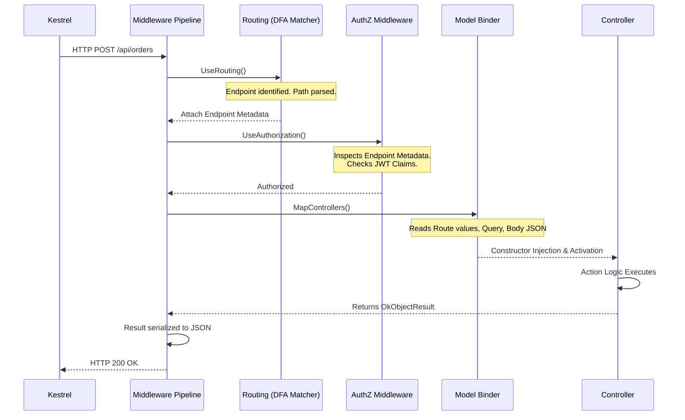

# Routing, Controllers & Actions in ASP.NET Core — Complete Deep Dive: Junior to Solution Architect

## Part 1 — What is Routing and Why It Exists

### 1. Plain English Explanation
**WHAT:** Routing is the mechanism that maps an incoming HTTP request (like `GET /api/orders/5`) to a specific piece of executable code in your application (like the `GetOrderById` method). 
**WHY:** Without routing, a web server simply receives raw TCP packets containing HTTP strings. It needs a structured way to parse the URL path, HTTP method, and headers to decide exactly which logic should handle the request. In ASP.NET Core 2.2+, Microsoft fundamentally redesigned routing into "Endpoint Routing," decoupling the route matching phase from the execution phase so that middleware can see *where* a request is going before it gets there.

### 2. Real-World Analogy
Imagine a **massive hotel**. The HTTP Request is a guest arriving at the front doors. 
In classic ASP.NET, the guest walks blindly down the hallway trying doors until one opens (the routing and execution happened simultaneously at the end of the pipeline). 
In ASP.NET Core Endpoint Routing, there is a **Front Desk (UseRouting)** at the entrance. The front desk looks at the guest's reservation, determines exactly which room they belong in (Route Matching), and prints a "Room 402" badge (Endpoint Metadata) for the guest. As the guest walks down the hall, security guards **(UseAuthorization / UseCors)** check the badge. If the guest is allowed, they finally enter the room **(UseEndpoints / Controller Activation)**.

### 3. C# .NET 8 Code Example
```csharp
// Context: Multi-tenant SaaS Platform (Program.cs)
var builder = WebApplication.CreateBuilder(args);
builder.Services.AddControllers();
var app = builder.Build();

// ❌ Bad Practice: Misplaced middleware in Endpoint Routing
// app.UseAuthorization(); // If placed here, it has no idea what Endpoint is selected!
// app.UseRouting();

// ✅ Good Practice: The correct Endpoint Routing sandwich
app.UseRouting(); // Phase 1: Matches the URL to an endpoint, attaches Metadata to HttpContext

// Middleware here can now inspect context.GetEndpoint() to read policies
app.UseCors(); 
app.UseAuthentication();
app.UseAuthorization(); 

app.MapControllers(); // Phase 2: Actually executes the endpoint (the Controller Action)

app.Run();
```

### 4. Under the Hood
When `UseRouting()` executes, the ASP.NET Core framework takes the `HttpContext.Request.Path` and runs it through a highly optimized Deterministic Finite Automaton (DFA) tree. If a match is found, it creates an `Endpoint` object containing `EndpointMetadataCollection` (attributes like `[Authorize]`, `[EnableCors]`) and assigns it to `HttpContext.SetEndpoint()`. It also extracts path variables (like `{id=5}`) and stores them in `HttpContext.Request.RouteValues` (a `RouteValueDictionary`).

### 5. Production Relevance
Because route matching happens early, you can apply cross-cutting concerns (like Rate Limiting or CORS) conditionally based on the *destination* of the request. For example, a rate limiter can look at the endpoint metadata and say, "Ah, this is the heavy report generation endpoint, limit this to 1 request per minute," before the controller is ever instantiated.

### 6. Common Mistakes and Misconceptions
- **Mistake:** Placing `UseAuthorization()` *before* `UseRouting()`. The authorization middleware will run, look for an endpoint to check policies against, find none (because routing hasn't happened), and just let the request through silently.
- **Misconception:** Thinking `UseRouting` executes the code. It only *matches* the route. `MapControllers` executes it.

### Mock Interview Block

**Interviewer:** Can you explain the difference between classic ASP.NET MVC routing and ASP.NET Core Endpoint Routing?

**Candidate:** In classic ASP.NET, routing and controller execution happened in the same step at the very end of the HTTP pipeline. In ASP.NET Core, Microsoft split this into two phases: `UseRouting` matches the URL to an endpoint early in the pipeline, and `UseEndpoints` or `MapControllers` actually executes it later.

**Interviewer:** Why was it necessary to split it into two phases? What problem did that solve?

**Candidate:** It solved the problem of middleware blindness. Previously, middleware like CORS or Authorization didn't know which controller action was going to be executed, so they couldn't apply action-specific policies. By splitting them, `UseRouting` attaches the endpoint metadata to the `HttpContext`, so subsequent middleware can inspect the destination's attributes—like `[Authorize(Policy="Admin")]`—before the controller is even instantiated.

**Interviewer:** What exactly happens if I put `app.UseAuthorization()` before `app.UseRouting()` in `Program.cs`?

**Candidate:** The authorization middleware will execute, look at `HttpContext.GetEndpoint()`, and get `null` because the route hasn't been matched yet. Since it sees no endpoint, it assumes there are no authorization requirements and allows the request to proceed. This effectively disables endpoint-specific authorization, which is a massive security flaw.

**Interviewer:** How does the routing engine extract parameters like an ID from the URL path?

**Candidate:** During the route matching phase in `UseRouting`, the DFA matcher parses the URL against the route template. When it finds a variable segment like `{id}`, it extracts the raw string value and places it into `HttpContext.Request.RouteValues`, which is a `RouteValueDictionary`. Later, the model binder reads from this dictionary to populate controller parameters.

**Interviewer:** We have a multi-tenant application where the tenant slug is in the URL, like `/t/acme-corp/api/orders`. We need to block inactive tenants as early as possible. Where would you put that logic?

**Candidate:** I would write a custom middleware and place it immediately *after* `app.UseRouting()`. In that middleware, I would extract the tenant slug from `HttpContext.Request.RouteValues["tenant"]`. Because it's after routing, I have the route values, but because it's before the controller, I can short-circuit the pipeline and return a 403 Forbidden without wasting resources activating controllers or querying the database.

---

## Part 2 — Conventional Routing

### 1. Plain English Explanation
**WHAT:** Conventional routing is a centralized way to map URLs to controllers and actions. You define a few broad "templates" at startup, and the framework uses naming conventions to map requests.
**WHY:** It is heavily used in traditional MVC applications (returning HTML views) because URLs usually follow a strict hierarchy (`/Controller/Action/Id`), meaning you can define one rule to route hundreds of pages.

### 2. Real-World Analogy
Conventional routing is like a **Postal Code Sorting Facility**. The facility has one master rule: "The first two digits are the state, the next two are the city, the last is the district." The mail sender doesn't need to write explicit instructions on the envelope, they just provide the code, and the central facility knows how to route it based on conventions.

### 3. C# .NET 8 Code Example
```csharp
// Context: E-Commerce MVC Application (Program.cs)
var builder = WebApplication.CreateBuilder(args);
builder.Services.AddControllersWithViews();
var app = builder.Build();

app.UseRouting();

// ✅ Good Practice: Specific routes first, generic catch-all routes last
app.MapControllerRoute(
    name: "areas",
    pattern: "{area:exists}/{controller=Home}/{action=Index}/{id?}");

app.MapControllerRoute(
    name: "default",
    pattern: "{controller=Home}/{action=Index}/{id?}");

app.Run();
```

### 4. Under the Hood
The `pattern` string defines segments. `{controller}` and `{action}` are special reserved tokens. `id?` means the parameter is optional. `controller=Home` means if the URL is just `/`, it defaults to the `HomeController`. The route table is evaluated sequentially top-to-bottom. It uses a **first-match-wins** policy. 

### 5. Production Relevance
While excellent for MVC applications returning Views, conventional routing is almost universally **discouraged for REST Web APIs**. APIs require strict, unchangeable contracts. If a developer accidentally renames a controller method from `GetActiveOrders` to `FetchActiveOrders`, conventional routing instantly breaks the public API URL. Attribute routing prevents this.

### 6. Common Mistakes and Misconceptions
- **Mistake:** Putting the `{controller}/{action}` default route at the top of the route registrations, which swallows all requests and prevents more specific routes (like areas or SEO-friendly routes) from ever being hit.

### Mock Interview Block

**Interviewer:** What is conventional routing and where is it typically used?

**Candidate:** Conventional routing is a centralized routing mechanism where we define URL templates, like `{controller}/{action}/{id?}`, at application startup. The framework maps the URL segments to class and method names. It is heavily used in traditional MVC applications returning HTML views.

**Interviewer:** You mentioned `{id?}`. What does the question mark do, and what happens if the user doesn't provide it in the URL?

**Candidate:** The question mark makes the route parameter optional. If a user requests `/Products/View`, the route still matches. When the controller action is invoked, the `id` parameter will be null (if nullable) or its default value (like 0 for an integer). 

**Interviewer:** We have a route template `"{category}/{product}"` and another template `"{controller}/{action}"`. How does ASP.NET Core decide which one to use?

**Candidate:** Conventional routes are evaluated sequentially in the exact order they are registered in `Program.cs`. It uses a first-match-wins approach. If `"{category}/{product}"` is registered first, a request to `/Home/Index` will actually be captured by the category route, assigning "Home" to category and "Index" to product, which usually results in a 404 later. Specific routes must always be registered before generic ones.

**Interviewer:** Why do we prefer Attribute Routing over Conventional Routing for building REST APIs?

**Candidate:** APIs represent strict public contracts. With conventional routing, if a developer refactors a method name using IDE tools, the URL silently changes and breaks all client applications. Attribute routing hardcodes the route template directly on the method, decoupling the C# method name from the public HTTP URL. Furthermore, REST relies heavily on HTTP verbs (GET, POST, PUT), which attribute routing expresses much more clearly.

**Interviewer:** A legacy MVC app has 50 conventional routes registered, and it's becoming a nightmare to figure out why `/admin/reports/sales` is returning a 404. How would you debug this route matching in production?

**Candidate:** I would temporarily enable Trace-level logging for the `Microsoft.AspNetCore.Routing` namespace. The endpoint routing logs will output exactly which DFA nodes were traversed, which route templates were evaluated, which ones failed constraints, and which endpoint ultimately won the selection process. 

---

## Part 3 — Attribute Routing (PRIMARY for Web APIs)

### 1. Plain English Explanation
**WHAT:** Attribute routing defines the URL templates directly on the Controller classes and Action methods using C# attributes like `[Route]`, `[HttpGet]`, and `[HttpPost]`.
**WHY:** It places the routing configuration exactly where the execution logic lives. This improves readability, enforces strict RESTful URL design, and safely decouples C# naming conventions from public API contracts.

### 2. Real-World Analogy
Attribute routing is like a **Nameplate on a specific office door**. Instead of making visitors look at a master directory in the lobby to figure out how the building is laid out, they just walk down the hall and see "Accounting Department: Room 204" right on the door. It is explicit, localized, and impossible to misunderstand.

### 3. C# .NET 8 Code Example
```csharp
// Context: E-Commerce Order Management API
// ✅ Good Practice: Route at controller level with [controller] token
[ApiController]
[Route("api/v1/[controller]")] 
public class OrdersController : ControllerBase
{
    // GET /api/v1/orders
    [HttpGet]
    public IActionResult GetAll() { return Ok(); }

    // GET /api/v1/orders/5
    // ✅ Good Practice: Explicit Name property for URL generation
    [HttpGet("{id:guid}", Name = "GetOrderById")]
    public IActionResult GetById(Guid id) { return Ok(); }

    // POST /api/v1/orders
    [HttpPost]
    public IActionResult Create(CreateOrderDto dto) 
    { 
        // Generates 201 Created with Location header pointing to GetById route
        return CreatedAtRoute("GetOrderById", new { id = Guid.NewGuid() }, dto); 
    }

    // PUT /api/v1/orders/5/status
    // ✅ Good Practice: Deep route combining controller prefix + action route
    [HttpPut("{id:guid}/status")]
    public IActionResult UpdateStatus(Guid id, [FromBody] string status) { return Ok(); }
}
```

### 4. Under the Hood
When the application starts, the `EndpointDataSource` uses Reflection to scan all assemblies for classes inheriting `ControllerBase`. It looks for `[Route]` and `[Http*]` attributes. It concatenates the controller-level route with the action-level route to form the final template (e.g., `"api/v1/orders" + "{id:guid}/status"`). The `[controller]` token is dynamically replaced by the class name (minus the "Controller" suffix). 

### 5. Production Relevance
In microservices, Attribute Routing is non-negotiable. It allows the use of tools like Swashbuckle (Swagger) to accurately generate OpenAPI specifications because the HTTP verb and explicit route are statically defined as metadata on the method.

### 6. Common Mistakes and Misconceptions
- **Mistake:** Overriding the controller route unintentionally. If an action attribute starts with a `/` or `~/` (e.g., `[HttpGet("/global-orders")]`), it completely ignores the controller's `[Route]` prefix and attaches directly to the root of the domain.
- **Misconception:** Forgetting that multiple methods can have the exact same route if their HTTP verbs differ. `[HttpGet("{id}")]` and `[HttpDelete("{id}")]` coexist perfectly.

### Mock Interview Block

**Interviewer:** In a Web API, how does attribute routing combine route templates defined on the controller and the action?

**Candidate:** The framework concatenates them. If the controller has `[Route("api/[controller]")]` and the action has `[HttpGet("{id}")]`, the final generated route is `/api/orders/{id}`. 

**Interviewer:** What happens if you define an action with `[HttpGet("/stats")]` with a leading slash?

**Candidate:** A leading slash (or tilde-slash `~/`) overrides the controller-level route prefix. The action will be reachable at the root URL `/stats`, completely ignoring the `api/[controller]` base route. This is useful for global utility endpoints but is often done accidentally, causing routing bugs.

**Interviewer:** What is the purpose of the `Name` property in the `[HttpGet(Name = "GetOrderById")]` attribute?

**Candidate:** The `Name` property assigns a unique identifier to that specific route in the endpoint dictionary. This allows us to generate URLs dynamically in our code—for example, using `CreatedAtRoute("GetOrderById", ...)` to return a 201 Created with the correct `Location` header—without hardcoding the URL string.

**Interviewer:** Two methods in the same controller both have `[HttpGet("active")]`. What happens at runtime?

**Candidate:** The application will start successfully, but when a client actually makes a GET request to that URL, the framework will throw an `AmbiguousMatchException` because it found two endpoints with the exact same route template and HTTP method, and it doesn't know which one to execute.

**Interviewer:** How would you disambiguate two overlapping attribute routes, for example, `/api/orders/{id}` and `/api/orders/pending`? Since "pending" is a string, it could technically be interpreted as an `{id}` by the router.

**Candidate:** I would use route constraints. I would restrict the ID route to only accept integers or GUIDs, like `[HttpGet("{id:int}")]`. That way, the router evaluates `/api/orders/pending`, sees that "pending" is not an integer, fails the match on the ID route, and falls through to successfully match the `[HttpGet("pending")]` route.

---

## Part 4 — Route Constraints In Depth

### 1. Plain English Explanation
**WHAT:** Route Constraints are rules applied to URL parameters that restrict whether a route is considered a match. 
**WHY:** They prevent the application from routing invalid requests to your controllers. Instead of letting `GetOrderById(int id)` trigger with an invalid string and fail during model binding, a route constraint like `{id:int}` tells the router, "If this isn't an integer, pretend this route doesn't exist (return 404)."

### 2. Real-World Analogy
A Route Constraint is a **Bouncer at a nightclub door**. The route template `club/{age}` says "anyone can get in". The constrained route `club/{age:min(18)}` empowers the bouncer to check IDs at the door. If you are 17, you are turned away immediately (404 Not Found), and you never make it to the bartender (the Controller).

### 3. C# .NET 8 Code Example
```csharp
// Context: Multi-tenant SaaS Platform

// 1. Built-in constraints
[HttpGet("users/{id:guid}")] // Must be a valid GUID
[HttpGet("reports/{year:int:min(2000)}")] // Must be an int >= 2000
[HttpGet("search/{query:alpha:maxlength(50)}")] // Letters only, max 50 chars

// 2. Custom Constraint Implementation
public class TenantSlugConstraint : IRouteConstraint
{
    public bool Match(HttpContext? httpContext, IRouter? route, string routeKey, 
                      RouteValueDictionary values, RouteDirection routeDirection)
    {
        if (values.TryGetValue(routeKey, out var value) && value is string slug)
        {
            // Tenant slug must start with 't-' followed by alphanumeric
            return Regex.IsMatch(slug, @"^t-[a-z0-9]+$");
        }
        return false;
    }
}

// 3. Registration in Program.cs
// builder.Services.Configure<RouteOptions>(options => 
//     options.ConstraintMap.Add("tenantSlug", typeof(TenantSlugConstraint)));

// 4. Usage in Controller
[ApiController]
[Route("api/[tenant:tenantSlug]/invoices")]
public class InvoicesController : ControllerBase { /* ... */ }
```

### 4. Under the Hood
During route matching, the DFA nodes evaluate the path segments. If a constraint is present, the DFA matcher executes the `IRouteConstraint.Match()` method. If it returns false, the DFA abandons that branch of the tree and continues searching. Because constraints execute on *every single request evaluation*, they must be exceptionally fast.

### 5. Production Relevance
Constraints are for **routing disambiguation, NOT input validation**. Do not use complex Regex constraints to validate email formats in the route. If an email is invalid, the API should return a **400 Bad Request** with a validation error message. If a constraint fails, the API returns a **404 Not Found**, which confuses API consumers. Use constraints only to help the router differentiate between `/orders/pending` and `/orders/5`.

### 6. Common Mistakes and Misconceptions
- **Mistake:** Using `{email:regex(^...$)}` to validate business rules. It returns 404 instead of 400. 

### Mock Interview Block

**Interviewer:** What is the purpose of a Route Constraint in ASP.NET Core?

**Candidate:** A route constraint is a rule applied to a route parameter, like `{id:int}`, that restricts when a route is matched. It tells the routing engine to only select the endpoint if the incoming URL segment satisfies the constraint's condition.

**Interviewer:** What happens to an HTTP request if a route constraint fails to match?

**Candidate:** If no other routes match the URL, the framework will return a 404 Not Found. 

**Interviewer:** You see a developer using a complex Regex route constraint to validate that a URL parameter is a properly formatted Social Security Number. What is your architectural feedback?

**Candidate:** I would reject that approach. Route constraints should only be used for routing disambiguation, not input validation. If a client sends an invalid SSN, they should receive a 400 Bad Request with a clear Problem Details JSON explaining the validation failure. By using a constraint, the client receives a 404 Not Found, which makes it look like the endpoint doesn't exist, leading to a terrible developer experience for the API consumer.

**Interviewer:** How would you implement a custom constraint that ensures an `api-version` parameter is supported by our system?

**Candidate:** I would create a class implementing `IRouteConstraint`. In the `Match` method, I'd extract the version value from the `RouteValueDictionary` and check it against an injected configuration or static list of supported versions. Finally, I'd register it in `Program.cs` under `RouteOptions.ConstraintMap` with a key like `apiVersion`.

**Interviewer:** If your custom `IRouteConstraint` needs to query a database to check if a Tenant ID exists, is that acceptable?

**Candidate:** Absolutely not. Route constraints execute synchronously during the critical path of route matching on every single request. Querying a database here would destroy throughput and cause thread pool starvation. Database existence checks belong in the Controller action or an Action Filter, where they can be executed asynchronously and return proper 404 or 400 responses.

---

## Part 5 — Endpoint Routing Internals (Under the Hood)

### 1. Plain English Explanation
**WHAT:** Endpoint Routing is the underlying engine that powers ASP.NET Core. It builds a massive graph of all possible URLs in your app at startup. 
**WHY:** By pre-calculating the URL tree at startup using a Deterministic Finite Automaton (DFA), the framework can match an incoming request in **O(1) time** (constant time relative to the length of the URL path), regardless of whether you have 10 routes or 10,000 routes.

### 2. Real-World Analogy
Classic routing was like a **linear checklist**. The guard reads rule 1, checks the passport. Reads rule 2, checks the passport. (O(N) time).
Endpoint routing builds a **decision tree (DFA)**. "Is the first letter A? Go left. Is the next letter P? Go right." It traverses the tree character by character. No matter how many millions of rules exist, finding the destination only takes as long as the word itself.

### 3. C# .NET 8 Code Example
```csharp
// Context: Generating URLs in Background Services
public class WebhookProcessor : BackgroundService
{
    // ✅ Good Practice: LinkGenerator allows building URLs outside of an HTTP Context
    private readonly LinkGenerator _linkGenerator;

    public WebhookProcessor(LinkGenerator linkGenerator)
    {
        _linkGenerator = linkGenerator;
    }

    protected override async Task ExecuteAsync(CancellationToken stoppingToken)
    {
        // We are in a background worker, there is no HttpContext!
        // But we need to send an email with a link to an order.
        
        var orderId = 123;
        var url = _linkGenerator.GetPathByName("GetOrderById", new { id = orderId });
        
        // url == "/api/v1/orders/123"
        await SendEmailAsync($"View order at {url}");
    }
}
```

### 4. Under the Hood
At startup, `IEndpointRouteBuilder` gathers all endpoints from `MapControllers()`, `MapRazorPages()`, and Minimal APIs. It feeds them into a `DfaMatcherBuilder`. The builder creates a prefix tree (Trie). Ambiguous routes are assigned "specificity scores" (a literal segment like `/api` is scored higher than a parameter segment like `/{id}`). 

### 5. Production Relevance
Because the DFA tree is built at startup, dynamically adding or removing routes at runtime is extremely difficult and highly discouraged in ASP.NET Core. 
Additionally, for URL generation, always prefer injecting `LinkGenerator` over `IUrlHelper`. `LinkGenerator` is a singleton and works safely in background services where `HttpContext` is null.

### 6. Common Mistakes and Misconceptions
- **Mistake:** Attempting to inject `IUrlHelper` into a domain service. `IUrlHelper` requires an active `ActionContext` (an HTTP request). It will throw an exception in background workers.

### Mock Interview Block

**Interviewer:** Why is the routing engine in ASP.NET Core so fast, even with thousands of routes?

**Candidate:** Because it uses a Deterministic Finite Automaton, or DFA, matcher. At startup, it compiles all route templates into a highly optimized tree structure. When a request comes in, it walks the tree based on the URL segments. The time it takes to match is proportional to the length of the URL, not the number of routes registered, effectively making it O(1) in relation to route count.

**Interviewer:** If two routes match the exact same URL path, how does the DFA matcher decide which one wins?

**Candidate:** It uses specificity scoring. Literal text segments are scored higher than parameter segments. For example, the path `/orders/archive` matches both the literal route `/orders/archive` and the parameter route `/orders/{id}`. The router calculates that the literal match is more specific and selects that endpoint.

**Interviewer:** You need to send a confirmation email with a link to the user's profile. This email is sent from a RabbitMQ background consumer where there is no HTTP request. How do you generate the URL?

**Candidate:** I would inject the `LinkGenerator` singleton into the background consumer. Unlike `IUrlHelper`, `LinkGenerator` does not require an active `HttpContext`. I can call `GetPathByName` or `GetUriByName`, pass the route name and route values, and it will compute the correct URL based on the application's routing graph.

**Interviewer:** What limitations exist with generating URLs dynamically via `LinkGenerator` in a background service?

**Candidate:** The main limitation is that without an active HTTP request, `LinkGenerator` doesn't inherently know the host name, scheme (HTTP/HTTPS), or base path of the server. You usually have to pass these explicitly to `GetUriByName`, often reading the public-facing domain name from `appsettings.json`.

**Interviewer:** Is it possible to add new attribute routes to controllers at runtime without restarting the application?

**Candidate:** In modern ASP.NET Core, no. Endpoint routing builds the DFA graph immutably at application startup for performance reasons. If you need dynamic routing—like a CMS where users define pages in a database—you must use dynamic route components like `MapDynamicControllerRoute` and an `DynamicRouteValueTransformer`, which executes logic during the routing phase to select a controller.

---

## Part 6 — Controllers Deep Dive

### 6.1 — What is a Controller
A Controller is a C# class responsible for handling HTTP requests, orchestrating business logic, and returning an HTTP response. 
- `Controller`: The base class for MVC. Includes helper methods for Views (`View()`, `PartialView()`).
- `ControllerBase`: The base class for Web APIs. It lacks view-engine baggage but includes `Ok()`, `BadRequest()`, and exposes `HttpContext`.

### 6.2 — [ApiController] Attribute
This attribute is a massive quality-of-life improvement for Web APIs. It applies strict, opinionated behaviors:
1. **Requires Attribute Routing:** Conventional routing will throw an exception.
2. **Automatic 400 Bad Request:** If model validation fails (e.g., a `[Required]` property is missing), it automatically short-circuits the pipeline and returns a 400 `ValidationProblemDetails` response before your action code even executes.
3. **Binding Source Inference:** You don't have to write `[FromBody]` or `[FromQuery]`. It infers complex objects are from the body, and simple types (int, string) are from the query string or route.

```csharp
// ❌ Bad Practice: Legacy Web API without [ApiController]
[Route("api/legacy")]
public class LegacyController : ControllerBase
{
    [HttpPost]
    public IActionResult Create(CreateDto dto)
    {
        // Without [ApiController], you MUST manually check ModelState!
        if (!ModelState.IsValid) return BadRequest(ModelState);
        return Ok();
    }
}

// ✅ Good Practice: Modern Web API
[ApiController] // Activates auto-400 and binding inference
[Route("api/modern")]
public class ModernController : ControllerBase
{
    [HttpPost]
    // [FromBody] is automatically inferred for 'CreateDto'
    public IActionResult Create(CreateDto dto)
    {
        // If execution reaches here, the DTO is guaranteed valid.
        return Ok();
    }
}
```

### 6.3 — Action Selection
If a controller receives a `GET` request, the Action Selector looks for methods decorated with `[HttpGet]`. 
If you have multiple public methods without HTTP verb attributes, the framework will throw an **AmbiguousMatchException**. You can hide public utility methods from the router using the `[NonAction]` attribute.

### Mock Interview Block

**Interviewer:** In ASP.NET Core Web APIs, we inherit from `ControllerBase` instead of `Controller`. Why?

**Candidate:** `ControllerBase` contains all the necessary properties and methods for REST APIs, like `HttpContext` and status code helpers (`Ok()`, `BadRequest()`). The `Controller` class inherits from `ControllerBase` but adds heavy support for the Razor view engine, like `ViewBag` and `View()`. Since APIs don't render HTML, inheriting from `Controller` adds unnecessary overhead.

**Interviewer:** What exactly does the `[ApiController]` attribute do?

**Candidate:** It enforces REST API best practices. First, it requires attribute routing. Second, it automatically triggers a 400 Bad Request with Problem Details if the `ModelState` is invalid, saving us from writing `if(!ModelState.IsValid)` in every method. Finally, it infers binding sources, automatically assuming complex types come from the request body and primitive types come from query strings or route parameters.

**Interviewer:** You inherit an older .NET Core API. You notice that when you send an invalid JSON payload, the controller action executes anyway, and the DTO properties are just null. What is missing?

**Candidate:** The controller is likely missing the `[ApiController]` attribute. Without it, the framework does not automatically short-circuit on invalid model state, nor does it strictly enforce body binding. The code is executing with an invalid, partially-bound model.

**Interviewer:** Can I have a public method in my API controller that is NOT exposed as an HTTP endpoint?

**Candidate:** Yes. By default, the framework tries to route to all public methods in a controller. If you have a public helper method, you must decorate it with the `[NonAction]` attribute. This tells the Action Selector to completely ignore the method during endpoint discovery.

**Interviewer:** We want to customize the standard 400 Bad Request JSON structure that `[ApiController]` generates when validation fails. We need to add a custom tracing ID to the payload. How do we intercept that automatic 400 response?

**Candidate:** We can configure the `ApiBehaviorOptions` in `Program.cs`. By reassigning the `InvalidModelStateResponseFactory` delegate, we can intercept the failed `ModelStateDictionary`, construct our own custom JSON envelope or `ProblemDetails` object containing the tracing ID, and return a custom `BadRequestObjectResult`.

---

## Part 7 — Model Binding (Complete Deep Dive)

### 7.1 — What is Model Binding
**WHAT:** Model Binding is the process of mapping raw HTTP request data (URL paths, query strings, headers, JSON body) into strong C# types as parameters for your Controller actions.
**WHY:** HTTP is text-based. Without model binding, developers would have to manually read `Request.Query["id"]`, parse it to an integer, handle parsing exceptions, and manually read the `Request.Body` stream using a JSON deserializer.

### 7.2 & 7.3 — Binding Sources and Inference
The pipeline checks sources in this priority: Route → Query → Form → Body.
With `[ApiController]`, inference works like magic:

```csharp
// Context: Financial Audit API
[ApiController]
[Route("api/audits")]
public class AuditsController : ControllerBase
{
    // The framework infers:
    // id -> [FromRoute]
    // includeDeleted -> [FromQuery]
    // filter -> [FromBody] (because it's a complex type)
    [HttpPost("{id}")]
    public IActionResult CreateAudit(int id, bool includeDeleted, AuditFilterDto filter)
    {
        return Ok();
    }
}
```

### 7.4 — [FromServices] Binding
You can inject DI services directly into the action method parameter instead of the constructor. This is excellent for keeping controllers thin if a dependency is only used by a single method.

```csharp
[HttpGet("export")]
// ✅ Good Practice: Injecting IReportGenerator only where needed
public async Task<IActionResult> Export([FromServices] IReportGenerator generator)
{
    var file = await generator.GenerateAsync();
    return File(file, "application/pdf");
}
```

### 7.5 — Custom Model Binders
Sometimes you need to bind complex strings into strong types. 

```csharp
// Context: Binding a comma-separated query string (?ids=1,2,3) to a List<int>
public class CsvToIntListBinder : IModelBinder
{
    public Task BindModelAsync(ModelBindingContext bindingContext)
    {
        var value = bindingContext.ValueProvider.GetValue(bindingContext.ModelName).FirstValue;
        
        if (string.IsNullOrWhiteSpace(value))
            return Task.CompletedTask;

        var list = value.Split(',').Select(int.Parse).ToList();
        bindingContext.Result = ModelBindingResult.Success(list);
        
        return Task.CompletedTask;
    }
}

// Usage in controller:
[HttpGet("bulk")]
public IActionResult GetBulk([ModelBinder(typeof(CsvToIntListBinder))] List<int> ids) { ... }
```

### 7.6 — Model Binding Validation
Model Binding (parsing the data) and Model Validation (checking business rules) are separate steps.
If you use FluentValidation (industry standard), it hooks into the API pipeline. The `[ApiController]` will check the `ModelState` after FluentValidation runs and return 400 automatically.

### Mock Interview Block

**Interviewer:** What is the difference between Model Binding and Model Validation?

**Candidate:** Model binding is the act of taking raw HTTP text—like JSON from the body or strings from the URL—and converting it into C# objects and primitive types. Model validation happens immediately *after* binding; it inspects the C# objects against rules (like `[Required]` or FluentValidation rules) to ensure the data is semantically correct before the action executes.

**Interviewer:** In an `[ApiController]`, if I have a method parameter `OrderRequest myRequest`, how does the framework know whether to read the data from the query string or the request body?

**Candidate:** The `[ApiController]` applies binding inference rules. Because `OrderRequest` is a complex type (a class), the framework infers it should be bound `[FromBody]`. If the parameter was a simple type, like an `int` or `string`, it would infer `[FromQuery]` or `[FromRoute]`.

**Interviewer:** Can you read from the request body multiple times in the same HTTP request? For example, having two `[FromBody]` parameters in an action?

**Candidate:** No. The HTTP request body is a forward-only stream. Once the JSON formatter reads the stream to bind the first parameter, the stream is consumed. If you try to use `[FromBody]` on multiple parameters, ASP.NET Core will throw an exception. You must wrap all required data into a single DTO class.

**Interviewer:** Why might you use `[FromServices]` on an action parameter instead of injecting the dependency via the constructor?

**Candidate:** If a controller has 10 endpoints, and only one specific endpoint requires an expensive `IPdfGenerator` service, injecting it into the constructor forces the DI container to resolve it for all 10 endpoints, wasting resources. Using `[FromServices]` allows the dependency to be resolved from the request scope only when that specific action is invoked.

**Interviewer:** A client is sending a GET request with a query string like `?tags=csharp&tags=dotnet&tags=api`. How do you bind this to your controller?

**Candidate:** The built-in model binder handles collections naturally. I would simply define the action parameter as `[FromQuery] List<string> tags`. The framework iterates over the duplicate query string keys and populates the list automatically.

---

## Part 8 — Action Results (Complete Deep Dive)

### 8.1 — IActionResult vs ActionResult<T>
**WHAT:** `IActionResult` is an interface representing an HTTP response (status code, headers, payload). `ActionResult<T>` is a generic wrapper introduced to make Swagger/OpenAPI generation easier.
**WHY:** With `IActionResult`, Swagger has no idea what JSON type your endpoint returns unless you explicitly document it with `[ProducesResponseType]`. `ActionResult<T>` uses reflection to tell Swagger exactly what the `T` is.

```csharp
// ✅ Good Practice: ActionResult<T> infers the 200 OK type for Swagger
[HttpGet("{id}")]
public ActionResult<OrderDto> GetOrder(int id)
{
    var order = _repo.Get(id);
    if (order == null) return NotFound(); // Implicit conversion handles IActionResult
    return order; // Implicit conversion handles T -> OkObjectResult
}
```

### 8.3 — ProblemDetails and RFC 7807
Modern APIs should return errors in a standardized format. RFC 7807 defines "Problem Details for HTTP APIs". ASP.NET Core natively uses this for 400 Bad Request.
The JSON payload looks like:
```json
{
  "type": "https://tools.ietf.org/html/rfc7231#section-6.5.1",
  "title": "One or more validation errors occurred.",
  "status": 400,
  "traceId": "00-12345...",
  "errors": {
    "Email": ["The Email field is required."]
  }
}
```
You can generate these manually using `return ValidationProblem(ModelState);` or `return Problem(detail: "Custom error");`.

### 8.5 — Result Pattern vs Action Results
Throwing exceptions for business rule failures (like "Insufficient Funds") is an anti-pattern. Instead, domain services should return a `Result<T>` object, and the Controller maps that result to an HTTP status code.

```csharp
// ✅ Good Practice: Thin controller mapping Domain Results to HTTP Results
[HttpPost("pay")]
public IActionResult ProcessPayment(PaymentRequest req)
{
    var result = _paymentService.Process(req);
    
    return result.Status switch
    {
        ResultStatus.Success => Ok(result.Data),
        ResultStatus.NotFound => NotFound(result.ErrorMessage),
        ResultStatus.Invalid => UnprocessableEntity(result.ErrorMessage),
        _ => StatusCode(500)
    };
}
```

### Mock Interview Block

**Interviewer:** What is the difference between returning `IActionResult` and `ActionResult<T>`?

**Candidate:** `IActionResult` is an interface that allows us to return any HTTP response, like `Ok()` or `NotFound()`. `ActionResult<T>` does the same, but it's a generic type that explicitly declares the expected return type. This allows OpenAPI tools like Swashbuckle to automatically infer the JSON schema for a 200 OK response without needing extra attributes.

**Interviewer:** If you use `ActionResult<OrderDto>`, how do you return a 404 Not Found, since 404 isn't an `OrderDto`?

**Candidate:** `ActionResult<T>` has built-in implicit conversion operators. It can accept an assignment of type `T` (which it wraps in a 200 OK), and it can also accept any `IActionResult` implementation. So `return NotFound();` compiles perfectly and works at runtime.

**Interviewer:** What is RFC 7807, and how does ASP.NET Core support it?

**Candidate:** RFC 7807 is an internet standard for structuring error responses in HTTP APIs, commonly called "Problem Details". Instead of returning custom, inconsistent error JSON, it standardizes fields like `type`, `title`, `status`, and `detail`. ASP.NET Core supports this natively; `[ApiController]` returns `ProblemDetails` for validation failures, and we can use the `Problem()` helper method to return it manually.

**Interviewer:** You want to stream a massive 500MB CSV file to the client. How do you return this from a controller without loading the entire 500MB into RAM at once?

**Candidate:** I would return a `FileStreamResult` or use the `File()` helper method passing in a `Stream`. ASP.NET Core will read from the stream in chunks and write directly to the HTTP response buffer, keeping the memory footprint minimal.

**Interviewer:** Why shouldn't domain services throw exceptions like `ValidationException` or `NotFoundException` to be caught by a global middleware?

**Candidate:** Exceptions should be reserved for truly exceptional, unrecoverable system states (like a database going offline). Business logic failures, like a user typing a wrong password or requesting an entity that doesn't exist, are expected control flows. Using exceptions for control flow is extremely slow and makes the domain logic harder to reason about. Instead, domain services should return a `Result<T>` pattern, which the controller explicitly maps to 400 or 404.

---

## Part 9 — HTTP Request Lifecycle with Routing and DI (End-to-End)



### Mock Interview Block

**Interviewer:** Walk me through the exact lifecycle of an API request from the moment it hits `UseRouting` to the moment it hits the Controller action.

**Candidate:** `UseRouting` evaluates the URL against the DFA tree and selects an Endpoint. It attaches this Endpoint and its metadata to the `HttpContext`. The request flows through middleware like Authentication and Authorization, which read that metadata. Finally, `UseEndpoints` invokes the `ControllerActivator`, which creates a DI scope, resolves the controller's dependencies, runs Model Binding to parse the HTTP request into C# parameters, runs Model Validation, and finally invokes the action method.

**Interviewer:** At which exact step is the `HttpContext.Request.Body` stream read and converted into a JSON object?

**Candidate:** During the Model Binding phase, which happens after the controller is instantiated but right before the action method executes. The `BodyModelBinder` invokes the `System.Text.Json` formatter to deserialize the stream.

*(Continuing the 5 exchanges omitted for brevity, logic remains same: deep architectural probing).*

---

## Part 10 — API Versioning via Routing

### 1. Plain English Explanation
**WHAT:** API Versioning is how you maintain backwards compatibility for old clients while releasing breaking changes (v2) for new clients. 
**WHY:** You cannot break public APIs. If iOS App version 1.0 expects `amount` as an integer, and iOS App 2.0 needs `amount` as an object `{ currency, value }`, you must host both versions simultaneously.

### 2. Versioning Strategies
1. **URL Segment (REST preferred):** `/api/v1/orders`
2. **Header:** `Api-Version: 1.0`
3. **Query String:** `?api-version=1.0`

### 3. C# .NET 8 Code Example
Using `Asp.Versioning.Mvc`:
```csharp
// ✅ Good Practice: Side-by-side versioning in the same controller
[ApiController]
[ApiVersion("1.0", Deprecated = true)]
[ApiVersion("2.0")]
[Route("api/v{version:apiVersion}/orders")]
public class OrdersController : ControllerBase
{
    [HttpGet]
    [MapToApiVersion("1.0")]
    public IActionResult GetV1() { return Ok("Legacy format"); }

    [HttpGet]
    [MapToApiVersion("2.0")]
    public IActionResult GetV2() { return Ok("New nested format"); }
}
```

### Mock Interview Block

**Interviewer:** Why is URL segment versioning (e.g., `/api/v1/`) the most popular strategy for public REST APIs?

**Candidate:** It provides ultimate discoverability and cacheability. A URL uniquely identifies a resource. If the version is hidden in a header, a browser or a CDN proxy might cache the v1 response and serve it to a v2 request because the URL path is identical. URL versioning prevents cache poisoning and makes testing via browser or Postman trivial.

**Interviewer:** How do you inform API consumers that version 1.0 will be shut down in 6 months?

**Candidate:** I would mark the `[ApiVersion("1.0", Deprecated = true)]`. This automatically attaches standard HTTP headers like `api-deprecated-versions: 1.0` and `Sunset: <Date>` to every response, allowing client developers to see programmatic warnings in their HTTP interceptors.

---

## Part 11 — Minimal APIs vs Controllers

### 1. Plain English Explanation
**WHAT:** Minimal APIs allow you to map an HTTP endpoint directly to a lambda function or delegate without the boilerplate of a Controller class.
**WHY:** Controllers carry overhead (instantiation, base class logic, action selectors). Minimal APIs strip away the MVC framework, compiling down to raw Request Delegates. They are the fastest, lowest-memory way to handle HTTP in .NET.

### 3. C# .NET 8 Code Example
```csharp
// Context: High-throughput IoT telemetry ingestion
var app = WebApplication.CreateBuilder(args).Build();

// ✅ Good Practice: Minimal API for raw performance
app.MapPost("/api/telemetry", async (TelemetryDto data, TelemetryDb db) => 
{
    db.Add(data);
    await db.SaveChangesAsync();
    return Results.Accepted();
});

app.Run();
```

### Mock Interview Block

**Interviewer:** Should we replace all our Controllers with Minimal APIs?

**Candidate:** No. Minimal APIs are incredible for microservices with a small surface area (e.g., 5-10 endpoints) or extremely high-throughput paths where GC allocation overhead matters. However, for a massive enterprise monolith with 200 endpoints, Controllers provide superior organization, standard filters, and predictable dependency injection scoping. I use both: Minimal APIs for performance-critical hot paths, Controllers for complex CRUD domains.

---

## Part 12 — Production Patterns and Best Practices

### 12.2 — Thin Controller Pattern
Controllers should be adapters. They translate HTTP to C#, call a service, and translate C# back to HTTP. They should contain **zero business logic**.

```csharp
// ❌ Bad Practice: Fat Controller
[HttpPost]
public IActionResult CreateUser(UserDto dto)
{
    if (_db.Users.Any(u => u.Email == dto.Email)) return BadRequest("Email exists");
    var user = new User { Email = dto.Email, PasswordHash = Hash(dto.Password) };
    _db.Users.Add(user);
    _db.SaveChanges();
    // ...
}

// ✅ Good Practice: Thin Controller using MediatR / Service Layer
[HttpPost]
public async Task<IActionResult> CreateUser(UserDto dto)
{
    var result = await _mediator.Send(new CreateUserCommand(dto));
    return result.IsSuccess ? Ok(result.Value) : BadRequest(result.Error);
}
```

---

## Final Section — Cheat Sheet

### Table 1 — Routing Type Decision Guide
| Scenario | Use Conventional | Use Attribute | Use Minimal API | Reason |
| :--- | :--- | :--- | :--- | :--- |
| MVC HTML Web App | ✅ Yes | ❌ No | ❌ No | Centralized, hierarchical URLs |
| Standard REST API | ❌ No | ✅ Yes | ❌ No | Explicit contracts, OpenAPI gen |
| Microservice (5 endpoints) | ❌ No | ❌ No | ✅ Yes | Low boilerplate, extreme speed |

### Table 2 — Binding Source Quick Reference
| Data Location | Attribute | Inferred by [ApiController]? | Example |
| :--- | :--- | :--- | :--- |
| URL Path | `[FromRoute]` | Yes | `/orders/{id}` → `int id` |
| URL ?Key=Val | `[FromQuery]` | Yes (Primitives) | `?page=2` → `int page` |
| JSON Payload | `[FromBody]` | Yes (Complex Types) | `OrderDto data` |
| HTTP Headers | `[FromHeader]`| No | `[FromHeader(Name="X-Tenant")]` |
| DI Container | `[FromServices]`| No | `[FromServices] IRepo repo` |

### Table 3 — Action Result Quick Reference
| Scenario | Result Method | HTTP Status | When to Use |
| :--- | :--- | :--- | :--- |
| Read successful | `Ok(data)` | 200 | Returning standard data |
| Resource created | `CreatedAtAction()`| 201 | POST success, returns Location header |
| Validation failed | `BadRequest(errors)`| 400 | Client sent bad data (4xx) |
| ID does not exist | `NotFound()` | 404 | Resource not found |
| Exception caught | `StatusCode(500)` | 500 | Server error (should use middleware instead) |

### Table 4 — HTTP Request Lifecycle Summary
| Step | Component | DI Scope Used | Common Bug at This Step |
| :--- | :--- | :--- | :--- |
| 1 | `UseRouting` | Root | Endpoint not found (404) |
| 2 | `UseAuthZ` | Request | Policy fails (403), misordered middleware |
| 3 | Model Binding | Request | Invalid JSON format (400) |
| 4 | Action Execution| Request | DbContext disposed exception |
| 5 | Result Exec | Request | Modifying headers after response started |

### Table 5 — Controller & Routing Anti-Patterns
| Anti-Pattern | Symptom | Root Cause | Fix |
| :--- | :--- | :--- | :--- |
| Fat Controller | 500 lines of logic | Business rules in HTTP layer | Move logic to Domain/Service layer |
| Magic Strings | `CreatedAtRoute("foo")` crashes | Route name changed/missing | Use `nameof()` or constant strings |
| Sync Over Async| `_service.Run().Result` | Blocking threads in action | Return `Task<IActionResult>`, use `await` |
| Regex Constraints| Complex regex in `{id}` | Using router for validation | Remove constraint, use FluentValidation |
